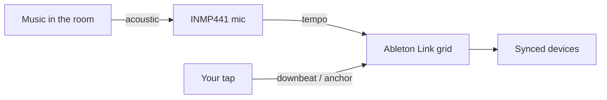
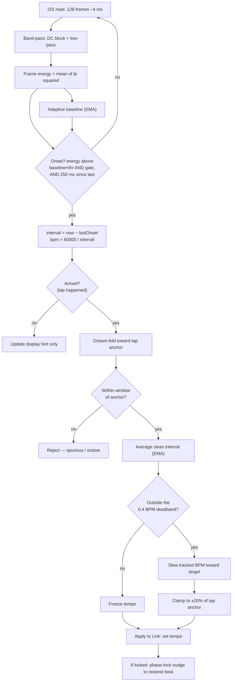
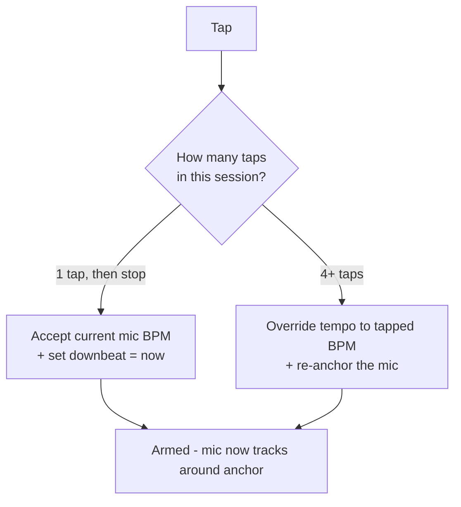
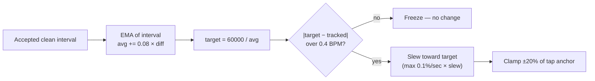
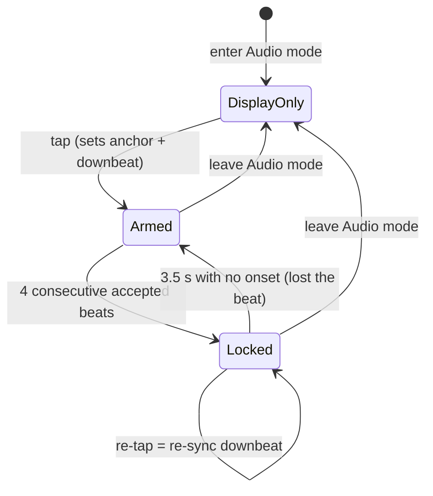

# tapbox — Audio Beat Detection

How the microphone-based BPM detection works, end to end.

This describes **Audio mode** (`MODE_AUDIO`), one of the three sync modes
(CDJ / Audio / Manual). All of the logic below lives in `mic_task()` and
`do_tap()` in `src/main.cpp`.

> Diagrams use [Mermaid](https://mermaid.js.org/) (GitHub renders them inline)
> plus ASCII where a waveform is clearer than a flowchart.

---

## 1. Design philosophy

The hard problem in automatic beat tracking is the **downbeat** — knowing which
pulse is "beat 1". tapbox sidesteps it by splitting the job between the human and
the machine:

| Job | Owner | Why |
|-----|-------|-----|
| **Tempo** (BPM) | the **microphone** | machines are good at measuring intervals |
| **Downbeat** (phase / "beat 1") | the **tap button** | humans hear musical phrasing |

So: **you tap the downbeat, the mic carries the tempo.** Your tap is *ground
truth*; the mic is only ever allowed to refine and track *around* it. This single
rule is why the system stays trustworthy — the mic can never wander off on its own.



---

## 2. The whole pipeline at a glance



Each stage is explained below.

---

## 3. Capturing audio (I2S)

- Mic: **INMP441** (digital I2S MEMS), `L/R` tied to GND.
- Sample rate: **32 kHz** — higher than strictly needed for the kick band, but
  halves the read-block size for better onset timing resolution.
- INMP441 channel selection on the ESP32 is a known finicky point (L/R→GND
  *should* select the left slot, but configs don't always behave). In our
  bring-up, **mono mode returned all-zero samples on both slot settings**, while
  reading **both** slots in stereo and using only the **left** samples worked
  reliably — so that's what we do (`i += 2` through the buffer). This is an
  empirical workaround for our setup, not a documented driver bug.
- Each read returns **256 int32 samples = 128 frames ≈ 4 ms** of audio.

---

## 4. Band-pass filter — isolating the kick

A kick drum lives around 50–150 Hz. We isolate it per sample with a cheap
two-stage IIR filter, then measure its energy.

```
 raw sample x ──► [ DC blocker ] ──► [ low-pass ] ──► lp ──► energy += lp²
                  (high-pass)        (~150 Hz)
```

```c
x  = sample / 2^31;                 // normalize to ~[-1, 1)
y  = x - xprev + 0.995 * hp;        // DC blocker  (kills sub-bass rumble/offset)
lp = lp + 0.03 * (y - lp);          // 1-pole low-pass (~150 Hz at 32 kHz)
energy += lp * lp;                  // accumulate over the read block
```

The result is one **frame energy** value per ~4 ms block: high during a kick,
low between kicks.

---

## 5. Adaptive threshold — finding the beats

We never use an absolute loudness threshold (that would need recalibrating for
every venue). Instead a slow **baseline** tracks the running energy, and a beat
is an energy **rise above that baseline**:

```c
baseline += 0.02 * (energy - baseline);     // slow floor (~0.4 s)
onset = (energy > baseline * threshFactor)  // a clear rise...
     && (energy > gate)                     // ...above the noise floor
     && (now - lastOnset > 250 ms);         // refractory → max ~240 BPM
```

ASCII view of a few beats — `*` marks a detected onset:

```
energy
  │            ╭╮                     ╭╮                     ╭╮
  │           ╭╯╰╮                   ╭╯╰╮                   ╭╯╰╮
  │     ╭╮   ╭╯  ╰╮      ╭╮         ╭╯  ╰╮      ╭╮         ╭╯  ╰╮
  │   ╭─╯╰───╯    ╰──────╯╰─────────╯    ╰──────╯╰─────────╯    ╰──
  │ ··········· baseline × thr (adaptive) ·······························
  │
  └──────*──────────────*────────────────*────────────────────► time
       kick           kick             kick
        │◄── interval ──►│
```

- `threshFactor = 1 + thr/10` (the `thr` menu knob). Higher → only strong kicks
  count, fewer false triggers.
- `gate` is an absolute floor (the `gate` knob, `energy > g_micGate × 1e-5`) so
  silence/room noise never locks. It sits *alongside* the relative `thr` test —
  `thr` asks "does this stand out above the running average?", `gate` asks "is
  this loud enough in absolute terms to bother with?", and an onset must clear
  **both**. This matters because the baseline is adaptive: in a near-silent room
  the average collapses to almost nothing, so tiny hum, hiss, or handling noise
  can satisfy `baseline × thr` on its own. The fixed `gate` is what stops that.
  - **Low (toward 0):** floor effectively off — only `thr` applies. Best for
    quiet sources, but a quiet room can self-trigger on ambient noise.
  - **High:** ignores quiet passages, room noise, and crosstalk (steadier
    locking in a loud, bass-heavy room); set it too high and genuine but quieter
    kicks fall below the floor, so beats get missed and it may never lock.
  - **Dialling it in:** raise `gate` if a quiet room self-triggers, lower it if
    real beats are missed. The `mic e=` (energy) line in the serial log during
    Audio mode shows both the room's idle level and the kick peaks — pick a value
    between them. Note the log prints `gate` pre-scaled as `g_micGate × 10`
    (i.e. `energy × 1e6` units), so the default `5` reads as `gate=50`.
- The **250 ms refractory** stops a single kick's ringing or a snare from
  double-triggering.

Each onset gives an **inter-onset interval**, and a raw BPM:

```
bpm = 60000 / interval_ms      (accepted only if 50 ≤ bpm ≤ 220)
```

---

## 6. Arming — the tap is ground truth

In Audio mode the mic is **display-only until you tap.** Your tap sets two
references used by everything downstream:

- `g_mic_tapAnchor` — the **anchor** tempo (centre of the acceptance window)
- `g_mic_tracked` — the **applied** tempo (what goes to Link)

**Tap grammar** (the box infers intent from how many taps arrive < 2 s apart):



- **One tap** = "I agree, beat 1 is *now*" — accepts the mic's current estimate
  and sets the downbeat.
- **Four taps** = override the tempo with your own tapping, re-anchoring the mic.
- Once armed and locked, a **lone tap just re-syncs the downbeat** without
  touching the tempo (the mic owns BPM).

---

## 7. Octave fold + acceptance window — rejecting garbage

Raw detection is noisy: hi-hats, snares, and double-hits produce spurious BPMs,
and the detector often reports half/double tempo. Two guards clean this up, both
judged against the **stable tap anchor** (not the moving output — that distinction
matters, see §8):

**(a) Octave folding** — pull obvious half/double errors back toward the anchor:

```c
while (cand > anchor * 1.4) cand *= 0.5;   // 252 → 126
while (cand < anchor * 0.7) cand *= 2.0;   //  63 → 126
```

**(b) Acceptance window** — after folding, keep only candidates within a fixed
**± BPM** of the anchor (`uind`, an absolute tolerance so it reads the same at any
tempo — you can tap to ~±2 BPM, so a few BPM is plenty):

```c
if (fabs(cand - anchor) <= uind_bpm)   // default ±4 BPM
```

```
                 reject │  accept (±4 BPM)  │ reject
   ───────────────●─────┼─────────●─────────┼──────●──────────► BPM
                 88     122      126        130    141
              (syncopated      the real kicks       (early hit /
               hit, folds      land here             harmonic,
               & rejected)                           rejected)
```

A detection like **88.9** (a syncopated hit) folds to ~178 and is rejected; an
early-hit stray at **141** is outside the window and rejected; a genuine **125–127**
sails through. This is what keeps `trk` steady even though the raw stream is full
of junk.

---

## 8. Why the window anchors to the *tap*, not the output

This is subtle but important. If the window were centred on the *current tracked*
value, then a tiny downward drift would make the window admit the long-interval
(low-BPM) detections while rejecting their short-interval partners — biasing it
**further** down, which feeds back and **ratchets** the tempo away.

Centring the window on the **fixed tap anchor** keeps admission symmetric: both
the slightly-fast and slightly-slow detections get in, and they average to the
truth. The output can refine and drift, but the *gate* it must pass through stays
nailed to your tap.

---

## 9. Turning intervals into a stable tempo

Three stages convert the accepted, noisy intervals into the smooth value sent to
Link:



1. **Interval EMA** — average the *interval* (not the BPM) of clean, un-folded
   beats. Averaging in the interval domain is unbiased and continuous, so it can
   represent e.g. 126.0 even though single reads only land on a coarse grid.
2. **Deadband (±0.4 BPM)** — once the tracked tempo is within 0.4 BPM of the
   target, **freeze it** so the displayed number stops flickering. Only genuine
   drift beyond the band moves it.
3. **Slew limit** — when it does move, cap the rate (`slew` knob, in 0.1 %/sec)
   so a stray reading can't yank it; a real DJ tempo ride sails through.
4. **Clamp (±20 % of the tap anchor)** — a hard safety rail. Even if everything
   else misbehaved, the mic can **never** fall into a half/double-tempo basin and
   lock there. Re-tap to move outside the rail.

---

## 10. Applying to Link — tempo *and* phase-lock

```c
abl_link_set_tempo(session, tracked, t);          // always: tempo
if (locked) {                                      // only once locked:
    beat    = abl_link_beat_at_time(session, t);
    nearest = round(beat);
    fixed   = beat + 0.15 * (nearest - beat);      // low-gain phase nudge
    abl_link_force_beat_at_time(session, fixed, t);
}
```

Tempo alone isn't enough: a 0.5 BPM error integrates into phase drift, and the
downbeat slowly walks off the music. So once **locked** (4 consecutive accepted
beats), a low-gain **phase-locked loop** gently pulls the beat grid so each
detected kick sits on the **nearest beat**:

```
                beat grid (Link)
   ──┬───────────┬───────────┬───────────┬──────►
     │           │           │           │
     ▼           ▼           ▼           ▼
   kick        kick        kick'       kick
                            └─ drifted a little late
                               → nudge grid 15% toward it each beat
```

Correcting to the **nearest** beat (never a whole bar) means the *bar position
you tapped is preserved* — your tap still decides which beat is "1"; the PLL only
keeps the pulse aligned. This is what holds the downbeat steady indefinitely,
even with the small residual tempo error.

---

## 11. Lock state & lifecycle



- **Display-only**: mic measures but does nothing to Link.
- **Armed**: tap anchored the tracker; mic is refining tempo.
- **Locked** (`lock=1`, shown by solid dot on the beat digit + bottom mode bar): stable
  tempo, phase-lock active.
- Lock drops after **3.5 s** with no detected onset (a breakdown / silence), then
  re-acquires when the beat returns.

---

## 12. Resolution floor and sub-frame timing

The raw read block is **~4 ms** at 32 kHz (halved from the original 8 ms by
raising the sample rate). To go further, onset timestamps are refined to the
**peak-energy sample within the read block** rather than the block boundary:

```c
uint64_t tPeak = tEnd - blockUs + (uint64_t)peakIdx * 1000000ULL / MIC_SAMPLE_RATE;
```

This eliminates the coarse quantisation grid almost entirely. A small residual
(~±0.5 BPM display wobble) remains from genuine onset jitter in the music and
room acoustics — this is physical noise, not a firmware limit.

The phase-lock (§10) keeps the actual Ableton Link grid glued to the music
regardless of that cosmetic wobble.

---

## 13. Tuning knobs (Audio-mode menu)

| Menu | Variable | Default | What it does |
|------|----------|---------|--------------|
| `thr`  | `g_micThr`  | 8 (→1.8×) | onset threshold = baseline × (1 + thr/10). Higher = only strong kicks |
| `gate` | `g_micGate` | 5 | absolute noise-gate floor (× 1e-5). Higher = ignores quieter signals |
| `uind` | `g_micWin`  | 4 | acceptance window ± BPM around the tap anchor (1–10). Tighter = rejects more strays; also caps how far it follows drift before a re-tap |
| `SLEu` | `g_micSlew` | 10 | tempo slew limit, in 0.1 %/sec. Higher = follows drift faster but jitters more |

Fixed constants (in `mic_task`): LP α = 0.03, baseline α = 0.02, refractory =
250 ms, interval EMA α = 0.08, deadband = 0.4 BPM, clamp = ±20 %, PLL gain = 0.15,
lock = 4 beats, lock timeout = 3.5 s.

---

## 14. Source map

| Piece | Location (`src/main.cpp`) |
|-------|---------------------------|
| I2S init (stereo, left slot) | `init_i2s_mic()` |
| Capture → band-pass → onset → tracking → phase-lock | `mic_task()` |
| Tap grammar (arm / override / re-sync) | `do_tap()` |
| Mode + lock display (mode bars, lock dot on beat digit) | `update_display()` |
| Tuning knobs (menu) | `MENU_MTHR / MGATE / MWIN / MSLEW` |
