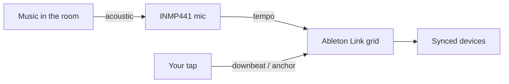
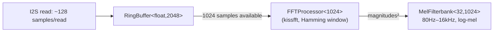
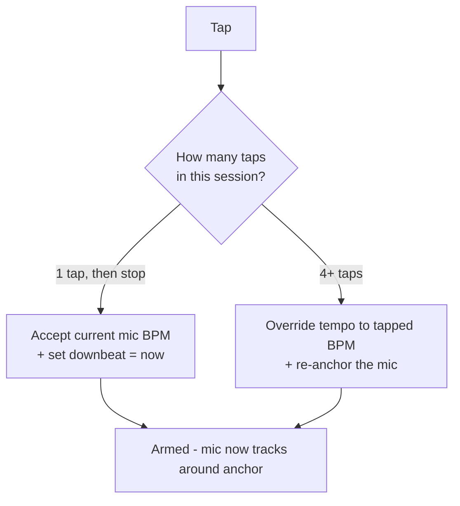
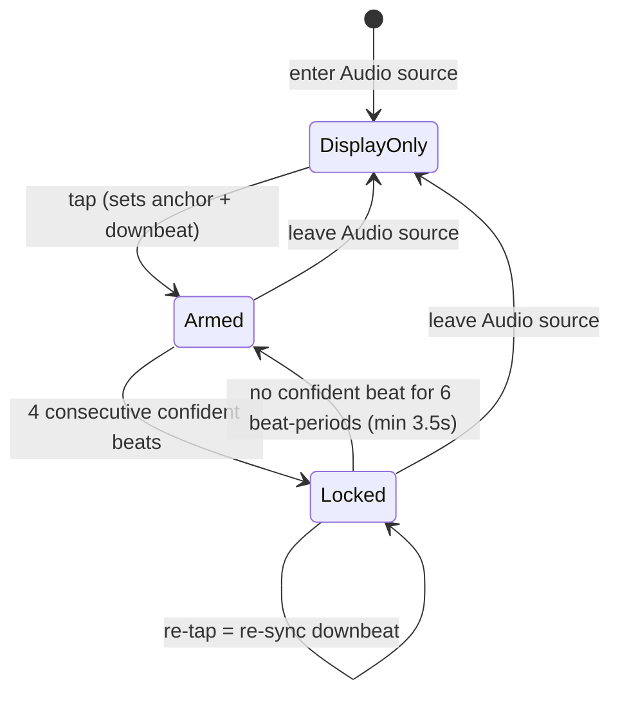

# tapbox — Audio Beat Detection

How the microphone-based BPM detection works, end to end.

This describes **Audio source** (`MODE_AUDIO`), one of the three sync sources
(CDJ / Audio / Manual). All of the logic below lives in `mic_task()` and
`do_tap()` in `src/main.cpp`, plus the DSP core ported (MIT-licensed) from
[absent42/esphome-audio-reactive](https://github.com/absent42/esphome-audio-reactive)
into `src/dsp/`.

> Diagrams use [Mermaid](https://mermaid.js.org/) (GitHub renders them inline)
> plus ASCII where a waveform is clearer than a flowchart.

---

## 1. Design philosophy

The hard problem in automatic beat tracking is the **downbeat** — knowing which
pulse is "beat 1". tapbox sidesteps it by splitting the job between the human and
the machine:

| Job | Owner | Why |
|-----|-------|-----|
| **Tempo** (BPM) | the **microphone** | machines are good at measuring intervals |
| **Downbeat** (phase / "beat 1") | the **tap button** | humans hear musical phrasing |

So: **you tap the downbeat, the mic carries the tempo.** Your tap is *ground
truth*; the mic is only ever allowed to refine and track *around* it. This single
rule is why the system stays trustworthy — the mic can never wander off on its own.



---

## 2. The detection pipeline

A proper FFT-based pipeline, ported from a MIT-licensed ESP32 audio-analysis
library and re-derived for tapbox's 32kHz mic (the library targets ESPHome
devices at 22.05/44.1kHz):

1. **`FFTProcessor`** — real FFT via [kissfft](https://github.com/mborgerding/kissfft) (vendored, BSD-3-Clause)
2. **`MelFilterbank`** — 32-band log-mel spectral representation
3. **`SuperFluxOnset`** — log-mel, max-filtered spectral flux (Böck & Widmer,
   DAFx 2013) — tuned to reject vibrato/legato and pick genuine attacks across
   the whole spectrum, not just one band
4. **`BTrack`** + **`TempoEstimator`** — a cumulative-score dynamic-programming
   beat tracker with fractional-lag harmonic-template tempo induction and a
   leaky-integrator smoother, re-implemented against the
   [adamstark/BTrack](https://github.com/adamstark/BTrack) reference

---

## 3. Capturing audio (I2S)

- Mic: **INMP441** (digital I2S MEMS), `L/R` tied to GND.
- Sample rate: **32 kHz**.
- INMP441 channel selection on the ESP32 is a known finicky point (L/R→GND
  *should* select the left slot, but configs don't always behave). In our
  bring-up, **mono mode returned all-zero samples on both slot settings**, while
  reading **both** slots in stereo and using only the **left** samples worked
  reliably — so that's what we do (`i += 2` through the buffer). This is an
  empirical workaround for our setup, not a documented driver bug.

---

## 4. FFT + spectral analysis

Raw samples accumulate into a ring buffer; once **1024 samples** (a 32ms window)
are available, a real FFT runs and the window slides forward by a **512-sample
hop** (16ms) — 50% overlap, giving a **62.5Hz** frame rate for everything
downstream (`kFrameHz` throughout `src/dsp/`).



512 usable FFT bins (`1024/2`) at 32kHz give 31.25Hz/bin resolution — coarser
than the upstream library's own 2048-pt/44.1kHz config (21.5Hz/bin), but half the
per-FFT compute cost, which matters since this all runs inline in `mic_task`
alongside I2S reads, sharing the chip with WiFi/Ethernet/HTTP/Link (no core
pinning is used anywhere in this codebase).

**This is the fast path** — the FFT→Mel→SuperFlux→BTrack chain (§3–6) runs on
*every hop* (62.5Hz). `BTrack::process()` is a stateful per-frame machine with
internal countdown timers; it must be fed every hop to behave correctly.

---

## 5. Mel filterbank + SuperFlux onset detection

The squared FFT magnitudes feed a 32-band triangular mel filterbank (80Hz–16kHz)
— the same perceptually-scaled representation used in most music-information-
retrieval onset detectors, giving finer resolution at low frequencies (where
kicks and bass live) than a linear FFT bin split would.

`SuperFluxOnset` (Böck & Widmer, DAFx 2013) then computes onset **strength** per
frame:

1. Log-compress the current mel frame
2. **Max-filter** the previous frame across ±3 neighboring mel bins — this
   specifically suppresses vibrato/legato content, which would otherwise look
   like a continuous stream of small "onsets" to a naive frame-difference
   detector
3. Half-wave-rectified difference between the current (log) frame and the
   max-filtered previous one = flux
4. Adaptive peak-picking (local-max window ± 3 frames, must exceed the local
   mean by a delta threshold over a ±10/+3 frame window) with a minimum
   36–48ms between onsets

The result is a continuous **onset-strength** signal plus a boolean **event**
flag on frames where a genuine onset is confirmed — this strength signal is what
feeds tempo tracking (§6), every hop, regardless of whether `event` fired.

---

## 6. BTrack — tempo tracking

`BTrack` consumes the onset-strength signal every hop and maintains:

- An **onset-history ring** (`kHistoryLen` = 384 frames ≈ 6.1s at 62.5Hz)
- A **cumulative-score** dynamic-programming array, blending the current onset
  strength with the best-scoring past state within a `[beat_period/2,
  2×beat_period]` window (log-Gaussian weighted) — this is what lets it predict
  *when* the next beat should fall, not just detect that a beat happened
- A **beat-prediction** step that extrapolates the cumulative score forward and
  picks the most likely next beat frame

**Tempo induction** (working out the actual BPM, as opposed to predicting the
next beat *given* a known BPM) runs once per predicted beat and is delegated to
`TempoEstimator`:

- Scores a continuous **60–180 BPM grid** (121 candidates, 1-BPM steps) using a
  **fractional-lag harmonic template** (4 harmonics of the candidate's beat
  period, evaluated at exact fractional lags into the autocorrelation, avoiding
  the bias integer-lag binning would introduce)
- A gentle **log-normal prior** centered on 120 BPM nudges octave ambiguity
  without creating a hard attractor
- A **leaky integrator** smooths estimates across updates — old evidence decays
  geometrically, so a wrong lock is escapable within roughly 10 beats
- **Confidence** is the fraction of the smoothed state's mass sitting within
  ±2 BPM of the current best estimate — high on real rhythmic music, near-zero
  on noise or silence — gated by requiring 4 consecutive updates to agree within
  ±3 BPM before calling the estimate "locked"

`BTrack` publishes `{bpm, beat_phase, confidence, beat_event}` every hop.
Confidence is forced to 0 for the first ~3 seconds after reset (`kWarmupFrames`)
while the onset-history ring fills with real data.

**Known limitation** (documented in `tempo_estimator.h`, inherited from the
upstream library's own measurements): the reliable range is **~85–160 BPM**.
Outside it, octave/sub-harmonic aliasing dominates — material with strong
eighth-note content below ~85 BPM confidently reports double tempo; above ~164
BPM a 2:3 or 1:2 alias can win. This isn't a tapbox-specific bug; it's an
inherent property of autocorrelation-based tempo induction on eighth-note-heavy
material, present in the reference implementation this was built against.

---

## 7. Arming — the tap is ground truth

With the Audio source, the mic is **display-only until you tap.** Your tap sets two
references used by everything downstream:

- `g_mic_tapAnchor` — the **anchor** tempo (centre of the octave fold and the BPM range gate, §8)
- `g_mic_tracked` — the **applied** tempo (what goes to Link)

All three — Tap, Audio, Link — are shown live as big numbers at the top of
the BPM tuning tab, so you can see your own tap alongside what the mic is
hearing and what's actually being published.

**Tap grammar** (the box infers intent from how many taps arrive < 2 s apart):



- **One tap** = "I agree, beat 1 is *now*" — accepts the mic's current estimate
  and sets the downbeat.
- **Four taps** = override the tempo with your own tapping, re-anchoring the mic.
- Once armed and locked, a **lone tap just re-syncs the downbeat** without
  touching the tempo (the mic owns BPM).

---

## 8. Follow/hold — applying BTrack's tempo

A beat only reaches the tiers below if it clears an **absolute level floor**
first (`g_micFloor`, dB, BPM tuning tab slider, default off at -100dB).
`SuperFlux` measures *relative* spectral change, so a quiet room still
produces confident, periodic "beats" out of something as unmusical as
keyboard typing — there is no loudness floor anywhere upstream of this gate.
A beat whose level falls below `g_micFloor` counts for **nothing**: not lock,
not PLL, not tempo. (Discovered when typing near an armed, silent tapbox
produced a run of confident, evenly-spaced "beats.")

The level checked is **smoothed, not the raw per-hop reading**: a single
32ms FFT hop's power swings roughly 20dB on room noise alone (measured
2026-07-09 — mic self-noise/room hum, not transient events), which is too
noisy to gate on directly. `frameLevelDb` (raw) feeds `levelEmaDb`, an
~800ms EMA (0.98/0.02 blend at the 62.5Hz hop rate); the floor gate and the
web page's Level readout both read `levelEmaDb`, not the raw value.

Confidence is **two-tier**, both tiers tunable sliders (`g_micConfSil` /
`g_micConfMove` on the BPM tuning tab, defaults 0.30 / 0.60) because usable
confidence varies a lot with the mic and the room — there's no fixed value
that works everywhere. Above the **lock** tier a beat keeps the lock alive
and the PLL phase-nudging (§9): beat *timing* stays useful even when the
tempo estimate is smeared. But **moving** the tempo requires the **move**
tier — most of `BTrack`'s probability mass agreeing on one value. This
matters because a quiet, beat-free passage can keep confidence just above a
low, fixed floor while the estimate wanders onto a harmonic alias — requiring
higher confidence to move turns that passage into a HOLD instead of an
alias-driven jump.

**FOLLOW** — on each beat clearing the level floor and the move tier, the
tempo is driven directly:

**(a) Octave fold toward the tap anchor** — the one disambiguation `BTrack`
demonstrably still needs (§6's ~85–160 BPM aliasing limit). The *operator*
knows which octave they meant; the fold applies that knowledge:

```c
while (cand > anchor * 1.4) cand *= 0.5;
while (cand < anchor * 0.7) cand *= 2.0;
```

The fold anchors to the **fixed tap anchor**, not the wandering output —
anchoring to the output would let a drift feed back on itself.

**(b) Snap, with an anti-flicker deadband** — if the folded candidate differs
from the tracked tempo by more than 0.4 BPM, the tracked tempo is set **equal
to it** in one step. No crawl: Link converges as fast as `BTrack` does. Moves
of 0.4 BPM or less are ignored, so the tempo published to every Link peer
doesn't flicker with estimation jitter — and because every real move lands
exactly *on* the candidate (rather than a slew stopping short of it), there is
no standing measured-vs-Link offset for the phase-lock (§9) to absorb.

**(c) BPM range gate** — a candidate more than `g_micRange` BPM from the tap
anchor (`g_mic_tapAnchor`, default ±6, tunable 1–20 on the BPM tuning tab)
does not move the tempo, full stop, no matter how confident the beat is.
Unlike (a)/(b), this isn't a fixed constant — it's the main knob for how much
you trust audio sensing to refine around your tap versus treating the tap as
the whole story (2026-07-09 redesign: the anchor itself never moves except by
re-tap; this gate only bounds how far `g_mic_tracked` may wander from it).
Binary in/out for now, no graduated confidence-vs-distance requirement yet.
Because `g_mic_tracked` can only ever be *set* to a candidate that already
passed this check, it's bounded to anchor±range by construction — there's no
separate clamp step the way the old fixed ±20% rail needed.

**HOLD** — anything below the move tier (silence, a breakdown, a beat-free
passage, a confidence dip mid-transition), below the level floor (typing,
handling noise), or **outside the BPM range gate** (a candidate too far from
the anchor to trust) freezes the tempo at its last good value. Nothing
chases low-confidence, too-quiet, or out-of-range readings; beats clearing
the floor and the lock tier (but not move-tier confidence, or not in range)
still maintain the lock and phase alignment, and `tapbox`'s lock drops after
the timeout (§9) if even those stop — but the tempo number stays put until a
beat clears every tier at once.

Beat events are latched across the fast 62.5Hz hop loop (`btBeatSincePoll` in
`mic_task()`) — each latch also stamps the beat hop's own smoothed level and
timestamp (`beatLevelDb`/`beatMs`, see the level-floor note above), so the
gate judges the beat's actual energy rather than whatever the slower 20Hz
poll sees — and consumed by that poll, so no `beat_event` is ever missed
between polls.

---

## 9. Applying to Link — tempo *and* phase-lock

```c
abl_link_set_tempo(session, tracked, t);          // always: tempo
if (locked) {                                      // only once locked:
    beat    = abl_link_beat_at_time(session, t);
    nearest = round(beat);
    fixed   = beat + 0.15 * (nearest - beat);      // low-gain phase nudge
    abl_link_force_beat_at_time(session, fixed, t);
}
```

Once **locked** (4 consecutive confident beats), a low-gain **phase-locked loop**
gently pulls the beat grid so each detected beat sits on the **nearest** beat —
never a whole bar, so the bar position you tapped is preserved.

---

## 10. Lock state & lifecycle



There are two layers of gating, worth keeping distinct:

- **`BTrack`'s own confidence/lock** (§6) — internal to the DSP, decides whether
  its BPM candidate is trustworthy at all. Can flicker during an active tempo
  change (e.g. a DJ pitch-bending a track) — that's expected, not a bug.
- **tapbox's armed/locked state** (this section) — fed by *confident* beats
  (§8's FOLLOW events): requires 4 confident beats in a row, drops after 6
  beat-periods (minimum 3.5s) without one.

A sustained confidence dip in `BTrack` (silence, a breakdown) puts the tempo
in HOLD and, past the timeout, drops tapbox's lock — but `BTrack`'s own `bpm`
field keeps updating underneath regardless of confidence, so it typically
re-locks within a couple of beats once confident beats return.

---

## 11. Tuning chart — BTrack's own signals, live

The web config page's **BPM tuning** tab chart plots exactly the quantities
the follow/hold logic (§8) compares, in their native units, over a rolling
6-second window.

**2026-07-09: the chart was a BPM strip (raw/Link BPM traces, top) stacked
over a confidence strip (bottom) — the BPM strip was removed entirely** (it
plotted a hardcoded ±20% band that no longer matched the real gate once
`g_micRange` replaced the fixed clamp, and the numbers it showed are already
covered live by the Tap/Audio/Link readouts at the top of the tab, §7). What
remains is a single **confidence strip**: the confidence trace (orange)
against the **lock** (grey dashed) and **move** (green dashed) slider
thresholds, redrawn live as the sliders move, plus a vertical tick per
BTrack-predicted beat — bright green if it cleared the move tier and the BPM
range gate (it drove the tempo), dim grey if it only cleared the lock tier
(including a beat confident enough to move tempo but outside the BPM
range), **red if BTrack predicted a beat but the level floor rejected it**.
A run of grey/green ticks poking above the move line with no music playing
is the typing-noise failure mode; a run of RED ticks during real music is
the opposite failure — real beats being wrongly rejected.

The chart, the live **Confidence**/**Level (dB)** readout beneath it (Level
is the same ~800ms-smoothed value the floor gate checks, §8), and the
"Last 10s: N beats · M moved tempo" line are all fed by the same 20Hz
telemetry packet `mic_task()` pushes over the `/ws` WebSocket. The chart
lives in the embedded copy in `http_get_root()` (`mDraw()`).

---

## 12. Live event log (web page "Log" tab)

A fourth tab on the web config page shows a scrolling, timestamped log of
notable events — useful for testing without a serial cable attached (e.g.
watching tempo tracking behavior while changing pitch/speed in DJ software).
Logged over the same `/ws` WebSocket connection the tuning chart uses,
distinguished from the telemetry CSV by an `L` prefix.

**Logged today:**
- Tap events — armed, downbeat re-synced, tap override (from `do_tap()`)
- Lock transitions — "Locked at N BPM" / "Lock lost (was N BPM)" (edge-triggered
  in `mic_task()`)

**Not logged:** a per-beat trace of `BTrack`'s raw (pre-confidence-gate) BPM
estimate — the existing "Audio BPM" readout already shows the
confidence-gated value live at 20Hz.

The log only does work while a browser has the page open (same
`ws_client_connected()` gate the chart telemetry uses), keeps no server-side
buffer, and caps at 300 lines client-side (older lines drop off, nothing
persists across a page reload).

---

## 13. Tuning knobs (web config page only)

None of these are on-device menu items — the on-device menu only carries
settings usable without a browser at hand (see `src/main.cpp`, `enum MenuIdx`).
All four mic-tuning parameters live on the **BPM tuning** tab of the web
config page, and all four are the real tempo path's actual gates (§8), not
chart-only knobs:

| Web field | Variable | Default | What it does |
|-----------|----------|---------|--------------|
| Level floor | `g_micFloor` | -100 dB (off) | Absolute floor, dB, checked against the ~800ms-smoothed level (§8), not the raw per-hop reading. Below it, a beat counts for nothing — no lock, no PLL, no tempo move. Range -100..-10. |
| Lock confidence | `g_micConfSil` | 0.30 | `BTrack` confidence required to keep the lock alive and feed the phase-lock PLL. |
| Move confidence | `g_micConfMove` | 0.60 | `BTrack` confidence required to actually change the tempo (FOLLOW vs. HOLD, §8). |
| BPM range | `g_micRange` | ±6 BPM | How far a candidate may be from the tap anchor and still move the tempo (§8's FOLLOW (c)). Outside it → HOLD, same as failing the confidence floor. Binary in/out, range 1–20. |

They're sliders rather than constants because none of the four has a value
that works everywhere: achievable confidence depends on the mic and the room,
the useful level floor depends on ambient noise and how loud the source is,
and how far you trust audio sensing to refine your tap is a judgment call
only you can make. Tune the floor and confidence tiers against the live
chart (§11) — play music, watch where the confidence trace and level readout
sit, then set them just outside that range.

**Level floor tuning note (2026-07-09):** a raw, unsmoothed single-hop level
reading is too noisy to gate on — measured swinging ~20dB during genuine
silence (mic self-noise/room hum, no transient events) in one real setup,
enough to overlap with quiet-to-moderate music at normal listening volume.
The ~800ms smoothing (§8) fixed this; with it, silence and music separated
into distinct (if sometimes narrow, depending on listening volume) bands. The
**factory default stays -100dB (off)** deliberately rather than shipping a
pre-tuned floor — an aggressive default would silently break audio-mode BPM
tracking for anyone who hasn't tuned it for their room, which is worse than
the false-beat problem a floor prevents. Expect this to matter less once
line-level input (PCM1808) replaces the acoustic mic path.

Fixed constants (not exposed): anti-flicker deadband 0.4 BPM, level-EMA time
constant ~800ms, PLL gain 0.15, lock = 4 confident beats, lock timeout =
6 beat-periods (min 3.5s), `BTrack` warmup ~3s.

---

## 14. Source map

| Piece | Location |
|-------|----------|
| FFT / mel filterbank / onset / beat tracker (ported DSP core) | `src/dsp/{fft_processor,mel_filterbank,superflux_onset,btrack,tempo_estimator}.h` |
| Vendored kissfft (BSD-3-Clause) | `src/dsp/third_party/kissfft/` |
| I2S init (stereo, left slot) | `init_i2s_mic()` in `src/main.cpp` |
| Capture → FFT → Mel → SuperFlux → BTrack → follow/hold → Link | `mic_task()` in `src/main.cpp` |
| Tuning chart (confidence strip, §11) | embedded in `http_get_root()` in `src/main.cpp` |
| Tap grammar (arm / override / re-sync) | `do_tap()` in `src/main.cpp` |
| Source + lock display (source bars, lock dot on beat digit) | `update_display()` in `src/main.cpp` |
| Live event log (web page Log tab) | `ws_log()` in `src/main.cpp` |
| Native (host-buildable) unit tests for the ported DSP core | `test/test_{ring_buffer,fft_processor,onset_detector,mel_filterbank,superflux_onset,btrack,tempo_estimator}/` |
