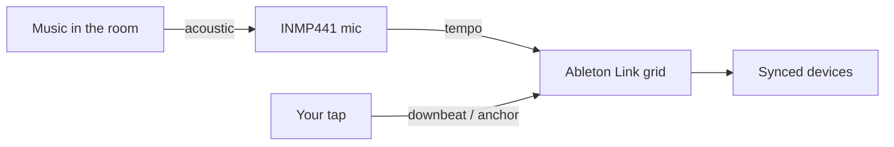
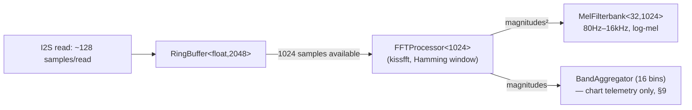
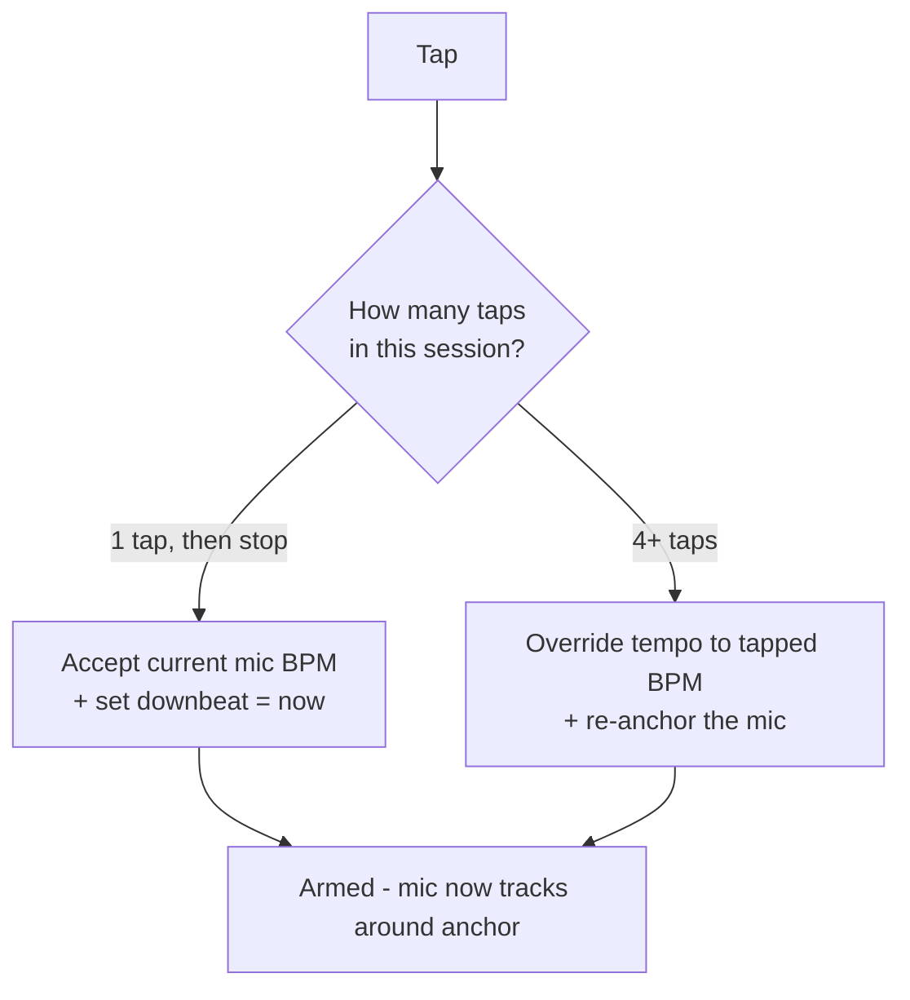
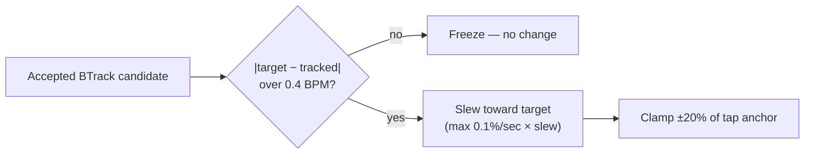
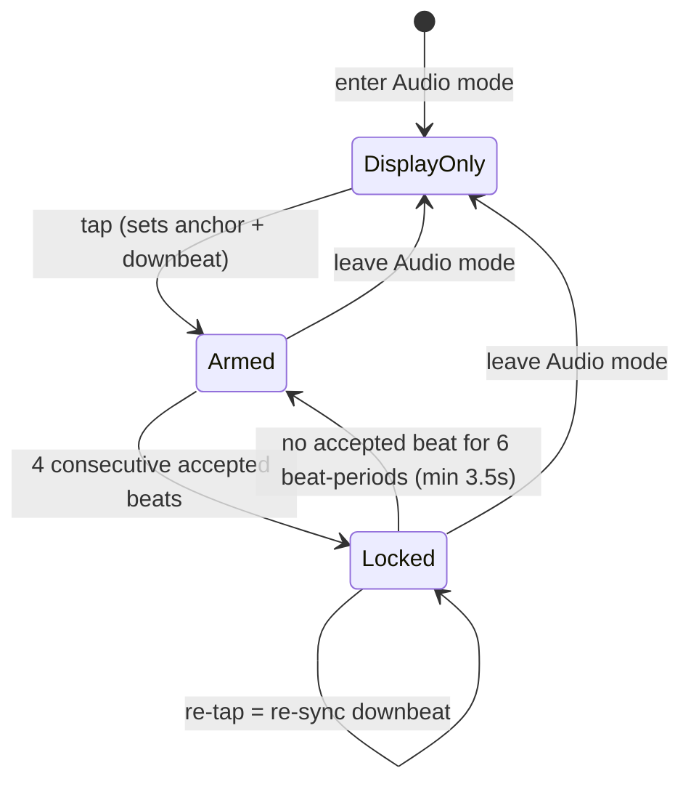

# tapbox — Audio Beat Detection

How the microphone-based BPM detection works, end to end.

This describes **Audio mode** (`MODE_AUDIO`), one of the three sync modes
(CDJ / Audio / Manual). All of the logic below lives in `mic_task()` and
`do_tap()` in `src/main.cpp`, plus the DSP core ported (MIT-licensed) from
[absent42/esphome-audio-reactive](https://github.com/absent42/esphome-audio-reactive)
into `src/dsp/`.

> Diagrams use [Mermaid](https://mermaid.js.org/) (GitHub renders them inline)
> plus ASCII where a waveform is clearer than a flowchart.

---

## 1. Design philosophy

The hard problem in automatic beat tracking is the **downbeat** — knowing which
pulse is "beat 1". tapbox sidesteps it by splitting the job between the human and
the machine:

| Job | Owner | Why |
|-----|-------|-----|
| **Tempo** (BPM) | the **microphone** | machines are good at measuring intervals |
| **Downbeat** (phase / "beat 1") | the **tap button** | humans hear musical phrasing |

So: **you tap the downbeat, the mic carries the tempo.** Your tap is *ground
truth*; the mic is only ever allowed to refine and track *around* it. This single
rule is why the system stays trustworthy — the mic can never wander off on its own.
This part of the design hasn't changed since the very first version; what changed
(see §2 onward) is the DSP that produces the tempo candidate the tap-anchor logic
judges.



---

## 2. History: from a kick-band filter to a real DSP pipeline

The original detector (through firmware v1.11.x) was a hand-tuned time-domain
pipeline: a two-stage IIR band-pass isolated "kick" energy around 50–150 Hz, an
adaptive baseline flagged rises above it as onsets, and an octave-fold +
acceptance-window scheme judged each raw interval against the tapped tempo. It
worked, but had a hard ceiling — it couldn't tell a kick drum from any other
percussive transient, and BPM candidates it produced from real music were noisy
enough that only 30–50% of detected beats ever passed the accept window.

The current detector replaces the entire signal chain with a proper FFT-based
pipeline, ported from a MIT-licensed ESP32 audio-analysis library and re-derived
for tapbox's 32kHz mic (the library targets ESPHome devices at 22.05/44.1kHz):

1. **`FFTProcessor`** — real FFT via [kissfft](https://github.com/mborgerding/kissfft) (vendored, BSD-3-Clause)
2. **`MelFilterbank`** — 32-band log-mel spectral representation
3. **`SuperFluxOnset`** — log-mel, max-filtered spectral flux (Böck & Widmer,
   DAFx 2013) — a materially better onset detector than a fixed-band energy rise,
   since it's tuned to reject vibrato/legato and pick genuine attacks across the
   whole spectrum, not just one band
4. **`BTrack`** + **`TempoEstimator`** — a cumulative-score dynamic-programming
   beat tracker with fractional-lag harmonic-template tempo induction and a
   leaky-integrator smoother, re-implemented against the
   [adamstark/BTrack](https://github.com/adamstark/BTrack) reference

A first pass ("basic tier": `OnsetDetector` + `BeatTracker`, a simpler
autocorrelation + comb-filterbank tracker) was tried first and shipped briefly,
but on real hardware with a 126 BPM ground-truth track its BPM estimate drifted
steadily to a stable-but-wrong ~133 BPM within seconds — the same class of
systematic bias the upstream library's own changelog documents fixing by moving
to `BTrack`/`TempoEstimator`. The current pipeline (§4–6 below) replaced it and
tracks the same test track correctly, without drift.

The basic-tier `OnsetDetector`/`BandAggregator` chain is still present in
`mic_task()`, but only to drive the tuning-page chart telemetry — it no longer
supplies the tempo. See §9.

---

## 3. Capturing audio (I2S) — unchanged

- Mic: **INMP441** (digital I2S MEMS), `L/R` tied to GND.
- Sample rate: **32 kHz**.
- INMP441 channel selection on the ESP32 is a known finicky point (L/R→GND
  *should* select the left slot, but configs don't always behave). In our
  bring-up, **mono mode returned all-zero samples on both slot settings**, while
  reading **both** slots in stereo and using only the **left** samples worked
  reliably — so that's what we do (`i += 2` through the buffer). This is an
  empirical workaround for our setup, not a documented driver bug.

---

## 4. FFT + spectral analysis

Raw samples accumulate into a ring buffer; once **1024 samples** (a 32ms window)
are available, a real FFT runs and the window slides forward by a **512-sample
hop** (16ms) — 50% overlap, giving a **62.5Hz** frame rate for everything
downstream (`kFrameHz` throughout `src/dsp/`).



512 usable FFT bins (`1024/2`) at 32kHz give 31.25Hz/bin resolution — coarser
than the upstream library's own 2048-pt/44.1kHz config (21.5Hz/bin), but half the
per-FFT compute cost, which matters since this all runs inline in `mic_task`
alongside I2S reads, sharing the chip with WiFi/Ethernet/HTTP/Link (no core
pinning is used anywhere in this codebase).

**This is the fast path** — the FFT→Mel→SuperFlux→BTrack chain (§4–6) runs on
*every hop* (62.5Hz), not decoupled to a slower poll like the old kick-filter
was. `BTrack::process()` is a stateful per-frame machine with internal countdown
timers; it must be fed every hop to behave correctly.

---

## 5. Mel filterbank + SuperFlux onset detection

The squared FFT magnitudes feed a 32-band triangular mel filterbank (80Hz–16kHz)
— the same perceptually-scaled representation used in most music-information-
retrieval onset detectors, giving finer resolution at low frequencies (where
kicks and bass live) than a linear FFT bin split would.

`SuperFluxOnset` (Böck & Widmer, DAFx 2013) then computes onset **strength** per
frame:

1. Log-compress the current mel frame
2. **Max-filter** the previous frame across ±3 neighboring mel bins — this
   specifically suppresses vibrato/legato content, which would otherwise look
   like a continuous stream of small "onsets" to a naive frame-difference
   detector
3. Half-wave-rectified difference between the current (log) frame and the
   max-filtered previous one = flux
4. Adaptive peak-picking (local-max window ± 3 frames, must exceed the local
   mean by a delta threshold over a ±10/+3 frame window) with a minimum
   36–48ms between onsets

The result is a continuous **onset-strength** signal plus a boolean **event**
flag on frames where a genuine onset is confirmed — this strength signal is what
feeds tempo tracking (§6), every hop, regardless of whether `event` fired.

---

## 6. BTrack — tempo tracking

`BTrack` consumes the onset-strength signal every hop and maintains:

- An **onset-history ring** (`kHistoryLen` = 384 frames ≈ 6.1s at 62.5Hz)
- A **cumulative-score** dynamic-programming array, blending the current onset
  strength with the best-scoring past state within a `[beat_period/2,
  2×beat_period]` window (log-Gaussian weighted) — this is what lets it predict
  *when* the next beat should fall, not just detect that a beat happened
- A **beat-prediction** step that extrapolates the cumulative score forward and
  picks the most likely next beat frame

**Tempo induction** (working out the actual BPM, as opposed to predicting the
next beat *given* a known BPM) runs once per predicted beat and is delegated to
`TempoEstimator`:

- Scores a continuous **60–180 BPM grid** (121 candidates, 1-BPM steps) using a
  **fractional-lag harmonic template** (4 harmonics of the candidate's beat
  period, evaluated at exact fractional lags into the autocorrelation — this is
  what avoids the old "basic tier" tracker's systematic bias, which came from
  snapping to integer-lag bins)
- A gentle **log-normal prior** centered on 120 BPM nudges octave ambiguity
  without creating a hard attractor
- A **leaky integrator** (not the older comb-filterbank + Viterbi approach)
  smooths estimates across updates — old evidence decays geometrically, so a
  wrong lock is escapable within roughly 10 beats
- **Confidence** is the fraction of the smoothed state's mass sitting within
  ±2 BPM of the current best estimate — high on real rhythmic music, near-zero
  on noise or silence — gated by requiring 4 consecutive updates to agree within
  ±3 BPM before calling the estimate "locked"

`BTrack` publishes `{bpm, beat_phase, confidence, beat_event}` every hop.
Confidence is forced to 0 for the first ~3 seconds after reset (`kWarmupFrames`)
while the onset-history ring fills with real data.

**Known limitation** (documented in `tempo_estimator.h`, inherited from the
upstream library's own measurements): the reliable range is **~85–160 BPM**.
Outside it, octave/sub-harmonic aliasing dominates — material with strong
eighth-note content below ~85 BPM confidently reports double tempo; above ~164
BPM a 2:3 or 1:2 alias can win. This isn't a tapbox-specific bug; it's an
inherent property of autocorrelation-based tempo induction on eighth-note-heavy
material, present in the reference implementation this was built against.

---

## 7. Arming — the tap is ground truth (unchanged)

In Audio mode the mic is **display-only until you tap.** Your tap sets two
references used by everything downstream:

- `g_mic_tapAnchor` — the **anchor** tempo (centre of the acceptance window)
- `g_mic_tracked` — the **applied** tempo (what goes to Link)

**Tap grammar** (the box infers intent from how many taps arrive < 2 s apart):



- **One tap** = "I agree, beat 1 is *now*" — accepts the mic's current estimate
  and sets the downbeat.
- **Four taps** = override the tempo with your own tapping, re-anchoring the mic.
- Once armed and locked, a **lone tap just re-syncs the downbeat** without
  touching the tempo (the mic owns BPM).

---

## 8. Accept window — judging BTrack's candidate

Every ~50ms, the latest `BTrack` result is judged against the tap anchor —
this guard-rail logic is unchanged from the original design and still matters:
`BTrack`'s own harmonic-template scoring and stability gate already do the heavy
tempo disambiguation, but a DJ tool still shouldn't let a beat tracker wander
arbitrarily far from what the operator actually tapped.

**(a) Cheap octave-fold safety net** — pull an obvious half/double candidate
back toward the anchor's octave (rarely needed now that `BTrack` does its own
disambiguation, but nearly free to keep):

```c
while (cand > anchor * 1.4) cand *= 0.5;
while (cand < anchor * 0.7) cand *= 2.0;
```

**(b) Confidence gate** — a candidate is only considered at all if `BTrack`'s
confidence exceeds `kSilenceConfidence` (0.3) — the same threshold the upstream
library uses to decide "trust this reading."

**(c) Acceptance window** — of the confident candidates, keep only those within
a fixed **± BPM** of the anchor (`g_micWin`, an absolute tolerance so it reads
the same at any tempo):

```c
if (fabs(cand - anchor) <= g_micWin_bpm)   // default ±4 BPM
```

### Why the window anchors to the *tap*, not the output

This is subtle but important, and unchanged from the original design. If the
window were centred on the *current tracked* value, a tiny downward drift would
make the window admit the long-interval (low-BPM) detections while rejecting
their short-interval partners — biasing it **further** down, which feeds back
and **ratchets** the tempo away. Centring the window on the **fixed tap anchor**
keeps admission symmetric.

---

## 9. Turning a candidate into a stable tempo (unchanged mechanism)



1. **Deadband (±0.4 BPM)** — once the tracked tempo is within 0.4 BPM of the
   accepted candidate, **freeze it** so the displayed number stops flickering.
2. **Slew limit** — when it does move, cap the rate (`g_micSlew`, in 0.1 %/sec)
   so a stray reading can't yank it; a real DJ tempo ride sails through.
3. **Clamp (±20 % of the tap anchor)** — a hard safety rail. Even if everything
   else misbehaved, the mic can **never** fall into a half/double-tempo basin
   and lock there. Re-tap to move outside the rail.

This EMA/deadband/slew/clamp machinery, and the Ableton Link publish + phase-lock
step below it, are DJ-facing UX logic that's orthogonal to which algorithm
supplies the tempo candidate — they carried over unchanged from the original
kick-filter design through both DSP rewrites.

---

## 10. Applying to Link — tempo *and* phase-lock (unchanged)

```c
abl_link_set_tempo(session, tracked, t);          // always: tempo
if (locked) {                                      // only once locked:
    beat    = abl_link_beat_at_time(session, t);
    nearest = round(beat);
    fixed   = beat + 0.15 * (nearest - beat);      // low-gain phase nudge
    abl_link_force_beat_at_time(session, fixed, t);
}
```

Once **locked** (4 consecutive accepted beats), a low-gain **phase-locked loop**
gently pulls the beat grid so each detected beat sits on the **nearest** beat —
never a whole bar, so the bar position you tapped is preserved.

---

## 11. Lock state & lifecycle



There are two layers of gating now, worth keeping distinct:

- **`BTrack`'s own confidence/lock** (§6) — internal to the DSP, decides whether
  its BPM candidate is trustworthy at all. Can flicker during an active tempo
  change (e.g. a DJ pitch-bending a track) — that's expected, not a bug.
- **tapbox's armed/locked state** (this section) — unchanged since the original
  design: requires 4 *accepted* beats in a row, drops after 6 beat-periods
  (minimum 3.5s) with no accepted beat.

A confidence dip in `BTrack` during a tempo bend means no candidates pass the
accept window for a few beats, which can in turn drop tapbox's own lock if it
persists past the timeout — but `BTrack`'s own `bpm` field keeps updating
underneath regardless of confidence, so it typically re-locks within a couple of
beats once the tempo settles.

---

## 12. Tuning-chart telemetry — a separate, older signal

The web config page's **BPM tuning** tab chart (blue energy trace, orange
threshold, red gate, green/grey onset dots) is **not** driven by the
FFT→Mel→SuperFlux→BTrack chain described above. It's still driven by the
"basic tier" `BandAggregator`/`OnsetDetector` pair (16 linear FFT bands,
spectral-flux onset detection), running at the same 20Hz cadence the old
kick-filter used, purely for chart/telemetry continuity — it does not feed
`BTrack` and does not drive the actual tempo.

This is a deliberate scope decision from the DSP rewrite: rebuilding the chart
around the new pipeline's own (differently-shaped) signals was out of scope
when the goal was fixing tempo-tracking accuracy. `g_micThr`/`g_micGate`
(onset threshold / noise floor) still tune this chart signal's onset detection,
not `BTrack`'s.

`g_micWin` (accept window) and `g_micSlew` (tempo slew) *do* apply to the real
tempo path (§8–9) — they're not chart-only.

Two internal constants (not exposed as sliders) bridge the old chart-scaling
convention to the new signal's actual magnitude — `kRawScale` and
`kTeleFluxScale` in `mic_task()` — both explicitly flagged in-code as needing
re-tuning against real hardware, the same way `g_micGate` itself was originally
hand-tuned.

---

## 13. Live event log (web page "Log" tab)

A fourth tab on the web config page shows a scrolling, timestamped log of
notable events — useful for testing without a serial cable attached (e.g.
watching tempo tracking behavior while changing pitch/speed in DJ software).
Logged over the same `/ws` WebSocket connection the tuning chart uses,
distinguished from the telemetry CSV by an `L` prefix.

**Logged today:**
- Tap events — armed, downbeat re-synced, tap override (from `do_tap()`)
- Lock transitions — "Locked at N BPM" / "Lock lost (was N BPM)" (edge-triggered
  in `mic_task()`)

**Not logged:** a per-beat trace of `BTrack`'s raw (pre-confidence-gate) BPM
estimate was discussed but not implemented — the existing "Measured BPM" readout
already shows the confidence-gated value live at 20Hz; a truly *ungated* signal
(showing what `BTrack` thinks even during low-confidence dips, e.g. mid pitch-bend)
would need new plumbing if wanted later.

The log only does work while a browser has the page open (same
`ws_client_connected()` gate the chart telemetry uses), keeps no server-side
buffer, and caps at 300 lines client-side (older lines drop off, nothing
persists across a page reload).

---

## 14. Tuning knobs (web config page only)

None of these are on-device menu items — the on-device menu only carries
settings usable without a browser at hand (see `src/main.cpp`, `enum MenuIdx`).
All four mic-tuning parameters live on the **BPM tuning** tab of the web config
page:

| Web field | Variable | Default | What it does |
|-----------|----------|---------|--------------|
| Onset threshold | `g_micThr` | 8 | Chart-telemetry onset sensitivity (§12) — inverted onto `OnsetDetector`'s 1–100 sensitivity scale |
| Noise gate | `g_micGate` | 17 | Chart-telemetry absolute noise floor (§12), log-scale |
| Accept window | `g_micWin` | 4 | ± BPM tolerance around the tap anchor for the **real** tempo path (§8) |
| Tempo slew | `g_micSlew` | 10 | Tempo slew limit, 0.1 %/sec, for the **real** tempo path (§9) |

The **Kick filter** slider (low-pass cutoff, `g_micFreq`) from the original
kick-band design has been retired — there's no equivalent single knob in an
FFT/mel-filterbank pipeline; frequency selectivity is now inherent to the
filterbank's fixed band structure. The **Accept test (A/B prototype)** selector
(`g_micGrid`, chain+octave-fold vs. phase-grid) was also retired — `BTrack`'s
own tempo induction now does that disambiguation internally.

Fixed constants (not exposed): deadband 0.4 BPM, clamp ±20%, PLL gain 0.15,
lock = 4 accepted beats, lock timeout = 6 beat-periods (min 3.5s), `BTrack`
confidence gate 0.3, `BTrack` warmup ~3s.

---

## 15. Source map

| Piece | Location |
|-------|----------|
| FFT / mel filterbank / onset / beat tracker (ported DSP core) | `src/dsp/{fft_processor,mel_filterbank,superflux_onset,btrack,tempo_estimator}.h` |
| Vendored kissfft (BSD-3-Clause) | `src/dsp/third_party/kissfft/` |
| Basic-tier chart telemetry (`BandAggregator`/`OnsetDetector`/`AGC`/`SilenceDetector`) | `src/dsp/{band_aggregator,onset_detector,agc,silence_detector}.h` |
| I2S init (stereo, left slot) | `init_i2s_mic()` in `src/main.cpp` |
| Capture → FFT → Mel → SuperFlux → BTrack → accept-window → Link | `mic_task()` in `src/main.cpp` |
| Tap grammar (arm / override / re-sync) | `do_tap()` in `src/main.cpp` |
| Mode + lock display (mode bars, lock dot on beat digit) | `update_display()` in `src/main.cpp` |
| Live event log (web page Log tab) | `ws_log()` in `src/main.cpp` |
| Native (host-buildable) unit tests for the ported DSP core | `test/test_{ring_buffer,fft_processor,onset_detector,mel_filterbank,superflux_onset,btrack,tempo_estimator}/` |
