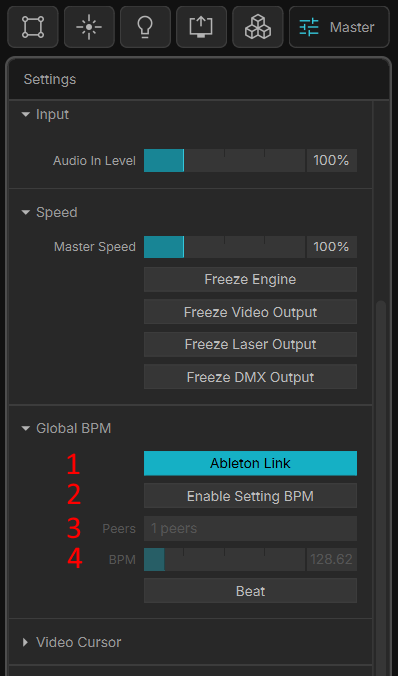
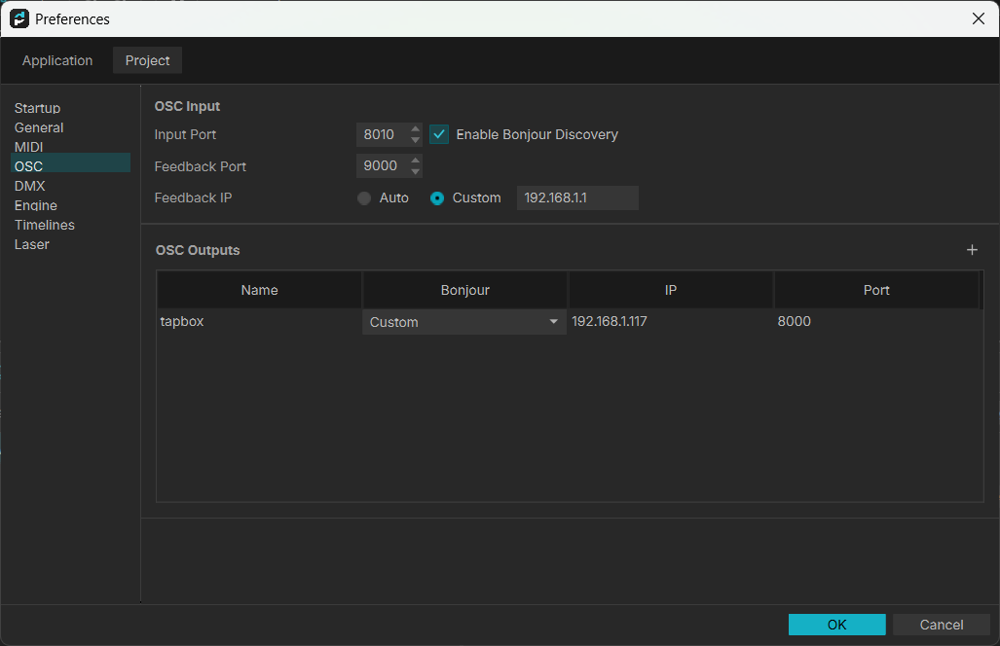
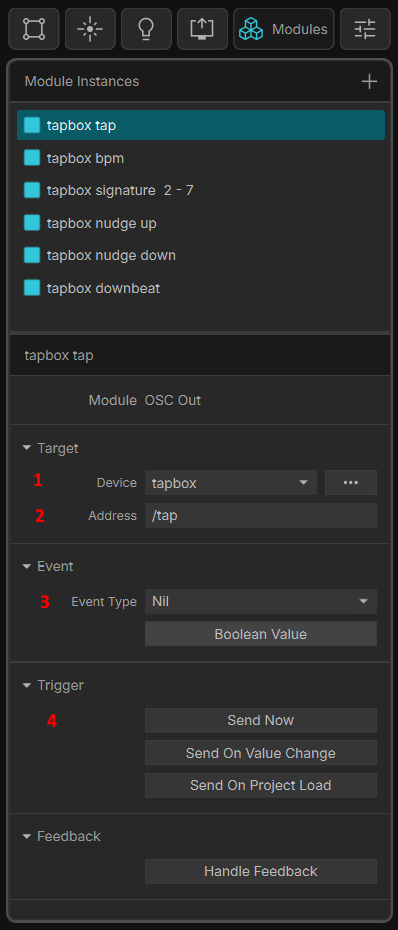

# tapbox with MadMapper

MadMapper works with tapbox in two complementary ways:

1. **Ableton Link** — MadMapper follows (or drives) the shared Link tempo that tapbox broadcasts. This needs no configuration beyond turning Link on.
2. **OSC** — MadMapper sends OSC commands *to* tapbox (tap, set BPM, nudge, and so on) so you can trigger tapbox from cues, buttons, or timelines inside MadMapper.

You can use either on its own, or both together.

---

## Ableton Link

Ableton Link support is built into MadMapper. On the **Master** tab, under **Global BPM**:

1. Turn on **Ableton Link** (1). MadMapper joins the Link session on the network.
2. By default MadMapper acts as a *follower* in the session. If you want MadMapper to be able to set the session tempo as well, turn on **Enable Setting BPM** (2).
3. With tapbox powered on and connected to the same network, the **Peers** field (3) shows at least `1 peer`. The count is higher when other Link-enabled programs are also on the network.
4. The current session tempo appears in the **BPM** field (4). When **Enable Setting BPM** is on, the BPM slider adjusts the Link tempo directly; otherwise it is read-only and simply reflects the tempo tapbox is broadcasting.

That is all Ableton Link needs. From here, whenever you tap a tempo on tapbox, MadMapper follows instantly.

---

## Sending OSC to tapbox

MadMapper's OSC modules can send specific commands to tapbox — the same commands listed in the **OSC Control** section of the [user manual](MANUAL.md#osc-control). This lets you trigger `/tap`, set a `/bpm`, nudge the phase, and more, from anywhere in your MadMapper project.

Setup is two steps: first tell MadMapper where tapbox lives on the network, then add an OSC module per command you want to send.

### 1. Define tapbox as an OSC output

Open **Preferences → Project → OSC** and add an entry under **OSC Outputs** (the **+** button on the right):

| Field       | Value                                              |
|-------------|----------------------------------------------------|
| Name (1)    | `tapbox` (any label you like)                      |
| Bonjour     | `Custom`                                           |
| IP (2)      | tapbox's IP address (e.g. `192.168.1.117`)         |
| Port        | `8000` — tapbox always listens for OSC on UDP 8000 |

The markers in the image call out the two fields that identify tapbox: its **Name** (1) and its **IP** address (2). Leave the **OSC Input** settings at the top of the dialog at their defaults — they are not needed to send commands to tapbox.

> Find tapbox's IP address on its display at boot — it scrolls the connection type and address (for example  `192.168.1.117`). If the address changes between sessions, give tapbox a static IP (set  to  on the device, then enter the address on the web config page's Network tab — see the manual) so this entry never needs updating.

### 2. Add an OSC Out module per command

On the **Modules** tab, add a module instance and set its **Module** type to **OSC Out**. Configure it:

- **Target → Device** (1): choose the `tapbox` output you defined in Preferences.
- **Target → Address** (2): the OSC address of the command, e.g. `/tap`, `/bpm`, `/nudge`.
- **Event → Event Type** (3): pick the payload type the command expects — `Nil` for commands that take no argument (like `/tap` or `/downbeat`), or a numeric type for commands that take a value (like `/bpm` or `/signature`).
- **Trigger** (4): use **Send Now** to fire the command manually, or **Send On Value Change** to drive it from a control, timeline, or mapped surface.

Create one module per command you want to control. A typical set mirrors the tapbox OSC command list:

| Module name        | Address       | Event Type | Notes                                  |
|--------------------|---------------|------------|----------------------------------------|
| tapbox tap         | `/tap`        | Nil        | Same as pressing the tap button        |
| tapbox bpm         | `/bpm`        | Float/Int  | Set tempo to a specific BPM            |
| tapbox signature   | `/signature`  | Int (2–7)  | Change the time signature              |
| tapbox nudge       | `/nudge`      | Float/Int (ms) | Shift phase by `ms` (+ = forward, − = back); no argument = 20 ms |
| tapbox downbeat    | `/downbeat`   | Nil        | Reset the downbeat to this moment       |

Once these exist you can map them to buttons, faders, or timeline cues anywhere in MadMapper.

---

## Tips

- **Link and OSC together:** use Ableton Link so MadMapper always displays and follows the live tempo, and use OSC modules for the actions Link doesn't cover — tapping a fresh tempo, forcing a downbeat, or nudging the phase.
- **Multicast between WiFi and Ethernet:** Ableton Link uses UDP multicast. Some routers don't bridge multicast between WiFi and Ethernet, so if MadMapper shows `0 peers`, put MadMapper and tapbox on the same interface (both Ethernet, ideally).
- **Static IP keeps OSC stable:** because the OSC output points at a fixed IP, giving tapbox a static address means your MadMapper project keeps working across reboots without re-entering the address.
