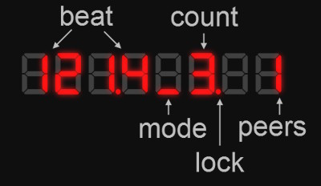

# tapbox User Manual

---

## What Is tapbox?

tapbox is a compact, dedicated tempo controller for musicians and live performers who use Ableton Link. It sits on your desk or in your rack, connects to your network via Ethernet or WiFi, and keeps every device in your setup locked to the same beat — without you having to touch a laptop.

The idea is simple: tap the button on the beat to set your tempo, and tapbox broadcasts it to every Link-enabled device on the network. Your Ableton Live session, Resolume, MadMapper, LaserOS, your iOS apps, your hardware synths with Link support — they all lock in instantly. From that point on you can send commands from a phone or tablet over OSC if you prefer to stay hands-free.

tapbox is always on, always listening, and always in sync.

---

## Getting to Know Your tapbox

### The Display

tapbox uses an 8-digit display that shows you everything you need at a glance.



Reading left to right:

- **beat** — the current tempo in BPM (`120.0`), updated in real time when any device in the Link session adjusts it
- **count** — which beat of the bar you are on right now (advances with the music)
- **lock dot** — the decimal point on the count digit: **solid** = locked (CDJ active / mic stable / tap set); **blinking** = Audio mode listening but not yet stable; **off** = no lock
- **mode bar** — a single horizontal segment just after the count digit shows which sync mode is active: **top = CDJ**, **middle = Manual**, **bottom = Audio**
- **peers** — how many other Ableton Link peers are connected to the session

On startup, tapbox joins the existing Link session tempo if one is already running, otherwise it starts at 120 BPM. You can tap a new tempo whenever you are ready.

### The Controls

tapbox has two buttons:

**Tap button** — the main button. Tap it in time with your music to set the tempo. A single tap immediately defines the downbeat (first beat of the bar). Three more taps locks in the tempo. In the menu, pressing tap moves to the next item or increments a value — hold it to auto-increment.

**Select button** — the confirm button. A short press enters the menu from normal mode, steps into an edit field, or confirms a value. Hold it for one second to go back or exit the menu. Hold select for 1 second to cancel.

---

## Setting the Tempo

Tap the tap button in rhythm. The downbeat for the Link session is immediately defined by the first tap. It takes three more taps before tapbox starts to adjust the tempo of the Link session. The current tempo and beat progress is displayed live at all times.

You do not have to be perfectly precise. tapbox averages the timing across all your taps, so the more taps in sequence, the more accurate the reading becomes.

After you are locked in, any further taps continue to refine the tempo. tapbox considers the session established when you stop tapping for two seconds. Simply start tapping again to define a new tempo.

---

## Sync Modes

tapbox can get its tempo three different ways. You pick one with the `node` menu item, and the active mode is shown by a bar on the display (top = CDJ, middle = Manual, bottom = Audio).

### Manual (`tAP`)

Classic tap tempo, exactly as described above. You are in full control — tap four times to set the tempo and the downbeat.

### Audio (`Aud`)

A small microphone listens to the room and works out the tempo for you, while **you** tap the downbeat. This is the hybrid mode: the machine handles the BPM, you handle the musical "beat 1".

How to use it:

1. Switch `node` to `Aud`. The bottom bar lights up. Nothing happens to the tempo yet — the mic is just listening.
2. Play the music near the microphone.
3. **Tap once on the beat** to accept the detected tempo and set the downbeat to that moment — or **tap four times** if you want to set the tempo yourself and let the mic refine it from there.
4. The beat digit's decimal point **blinks** while the mic is searching for a stable lock, then goes **solid** once locked. From then on the tempo tracks the music automatically; a single tap any time re-aligns the downbeat without changing the tempo.

The detector is tuned for a clear kick drum. Four menu items (`uind`, `SLEu`, `thr`, `gAte`, shown only in Audio mode) fine-tune it — see the technical write-up in `BEAT_DETECTION.md` if you want to understand or adjust them.

### CDJ (`Cdj`)

tapbox passively reads Pioneer Pro DJ Link beat packets off the network and feeds the CDJ's tempo straight into Ableton Link — no tapping needed. See the CDJ details below.

---

## Connecting to Your Network

### Ethernet

Plug a standard network cable into the Ethernet port before powering on. tapbox scrolls the connection type and assigned IP address across the display at startup — for example `Eth 192.168.1.55`. This tells you where to find it on the network for OSC control.

Ethernet is always preferred over WiFi. If both are available, tapbox uses Ethernet.

### WiFi

tapbox can connect to your WiFi network and run Ableton Link over it. This is useful when your performance space does not have an Ethernet switch nearby, or when you need to sync with a device that is on WiFi and your router bridges multicast between the two interfaces.

**The ESP32 radio supports 2.4 GHz only.** If your router has separate 2.4 GHz and 5 GHz networks (often shown as two different SSIDs, or a combined band with a single SSID), make sure you use the 2.4 GHz SSID when entering credentials.

#### First-time WiFi setup

1. Boot tapbox without an Ethernet cable plugged in.
2. tapbox creates a WiFi network called **tapbox** and scrolls `AP 192.168.4.1` followed by an 8-digit PIN across the display — the PIN fills the whole display and pauses there for 6 seconds so you have time to read it.
3. Connect your phone or laptop to the **tapbox** network, using that PIN as the WiFi password.
4. Open **http://192.168.4.1** in your browser. It will ask for a username and password — enter `tapbox` and the same PIN.
5. Enter your WiFi network name (SSID) and password. The SSID field is case-sensitive — copy it exactly from your phone's WiFi list.
6. Tap **Save Network — tapbox will reboot**. The device saves the credentials and reboots, then connects to your network as a WiFi client and scrolls `StA` followed by the assigned IP address.

The PIN is derived from the device's own hardware, so it's fixed for the life of that unit and never needs to be written down — it follows the IP address on the display at every boot or reconnect, in any mode (Ethernet, WiFi, or AP), and is always available from the `Addr` item in the menu.

> **What the PIN is for:** it exists to stop someone at a gig or in an office from wandering up to tapbox and casually changing your settings — it is not intended as strong security. Anyone determined enough to take the firmware apart could work out how the PIN is derived. Don't rely on it to protect anything beyond "keep the unsuspecting public out."

#### Changing WiFi credentials later

Unplug the Ethernet cable (or boot without one). If the stored credentials fail, tapbox falls back to AP mode automatically — connect to the **tapbox** network using its PIN and open **http://192.168.4.1** to update them.

#### Automatic Ethernet / WiFi switching

tapbox switches interfaces automatically without a reboot:

- **Ethernet plugged in** → tapbox stops WiFi and switches Link to Ethernet.
- **Ethernet unplugged** → tapbox starts WiFi (connecting to stored credentials, or starting the access point if none are stored).

If WiFi credentials fail to connect, tapbox falls back to AP mode immediately so you can reconfigure without rebooting.

By default tapbox uses DHCP. If you need a fixed address, set `Lan.` to `Stat` on the device and enter the IP/subnet/gateway on the web config page (see below) — this applies to whichever interface, Ethernet or WiFi, is actually active.

### Web Configuration Page

The config page is available at the device's IP address on port 80, from any browser over Ethernet or WiFi. Your browser will prompt for a username and password — enter `tapbox` and the 8-digit PIN that follows the IP address on the display (or via `Addr` in the menu). This applies every time, in every mode, since the page can change any setting on the device. The page is split into two independent sections:

**Network** (WiFi SSID/password, network mode, static IP/subnet/gateway) — tap **Save Network — tapbox will reboot** to apply. The orange button is a reminder that a reboot follows. Network mode has three options — DHCP, Static, and Access Point — and static IP/subnet/gateway apply to whichever interface (Ethernet or WiFi) is active.

**Settings** (time signature, sync mode, brightness, audio tuning) — tap **Save Settings** to apply immediately. No reboot occurs; the device updates live and the page returns with a confirmation link.

---

## The Settings Menu

Press the select button to open the menu. Press the tap button to move between items. Press the select button to enter edit mode for the selected item, then press the tap button to change the value (hold for fast auto-increment). Press select again to confirm and return to the menu.

To go back from an edit, hold the select button for one second. To exit the menu entirely, hold select or wait six seconds — tapbox returns to normal mode without saving the current edit. When you next open the menu it returns to the last item you were on.

---

### Beat — Time Signature

**What it does:** tells tapbox how many beats are in a bar.

The beat counter on the display counts from 1 up to this number, then loops back to 1. This keeps you visually oriented in the musical phrase.

**Available values:** 2, 3, 4, 5, 6, 7

**When to use it:** if you are playing a waltz in 3/4, set this to 3 so the counter runs 1–2–3 rather than counting to 4 and going out of sync with the phrase. For odd-time signatures like 7/8, set it to 7.

*Default: 4*

---

### Led — Display Brightness

**What it does:** adjusts how bright the display glows across four levels (1 – 4).

The display gives you a live preview as you change the value. In a dark venue, level 1 or 2 keeps it readable without becoming distracting. In a brightly lit studio, level 4 is easy to read from across the room.

*Default: 2*

---

### node — Sync Mode

**What it does:** selects where tapbox gets its tempo. Three values:

- **`Cdj`** — Pioneer Pro DJ Link (see below)
- **`Aud`** — audio beat detection from the microphone (you tap the downbeat)
- **`tAP`** — manual tap tempo

The active mode is shown by a bar on the display (top = CDJ, middle = Manual, bottom = Audio). See the **Sync Modes** section earlier in this manual for how each one works in practice.

**About CDJ mode:** when set to `Cdj`, tapbox listens on the same Ethernet switch as your CDJ players and reads their beat timing automatically. The active CDJ's BPM is fed directly into the Ableton Link session — all your Link peers follow the CDJ without any tapping. A `C` indicator confirms the lock. tapbox follows the lowest player number (1 → 2 → 3 → 4); if that player stops for more than two seconds it drops to the next. While a CDJ is actively driving the tempo, the tap button is ignored — the CDJ is in control. If no CDJ is present, CDJ mode behaves like manual tap tempo.

> CDJ sync requires Ethernet, on the same wired switch as the players. Nothing is installed on the CDJs — tapbox listens passively.

*Default: Aud*

---

### Audio Tuning

The four microphone beat-detector parameters are configured on the **web config page** — there's no practical way to dial these in one tap at a time, and they're rarely touched once set:

- **Accept window** (± BPM, 1–10): how far a detected beat may sit from your tapped tempo before it is ignored. Since you can tap to within ~2 BPM, a small value like 3–4 rejects most spurious hits.
- **Tempo slew**: how fast the detected tempo is allowed to move (rate limit), in units of 0.1 %/sec.
- **Onset threshold**: how much a kick must stand out to count. Higher rejects more false hits.
- **Noise gate** (0–50): an absolute loudness floor. A sound has to be at least this loud to count as a beat at all, no matter what else is happening. The scale is logarithmic — low values sit just above room silence, high values reach loud-venue levels — so each step matters more as you go up.

The web page shows a **live chart** of the microphone signal while you adjust these — the blue trace is the incoming energy, the orange dashed line is the onset threshold, the red dashed line is the noise gate, and green dots mark each detected beat. Drag the sliders and watch the trace cross the lines in real time, rather than guessing a number and listening afterward. Each slider applies immediately, live — there's no separate save step for these while tuning.

Below the chart, a live readout shows the **measured BPM** (raw, from the last detected beat interval), the **Link BPM** (the smoothed tempo actually driving the session), the tracking state (idle / searching / locked), and a rolling 10-second count of **beats detected vs accepted**. Detected-but-not-accepted beats were outside the accept window — a high detect count with a low accept count means the detector hears rhythm that disagrees with the current tempo (wrong tempo anchor, or spurious hits).

The defaults work for typical four-on-the-floor material. For the full explanation of what each does and how to dial them in, see `BEAT_DETECTION.md`.

---

### Lan. — Network Mode

**What it does:** switches network addressing between automatic (DHCP), manual (static), and forced Access Point mode — applies to whichever interface, Ethernet or WiFi, is currently active.

- **Auto** — your router assigns tapbox an IP address automatically every time it boots.
- **Stat** — tapbox uses a fixed IP address, entered on the web config page (see below).
- **AP** — tapbox starts a wifi network called `tapbox` with IP address `192.168.4.1`. Useful if there's no other way to reach a browser, or if your normal WiFi network associates but won't actually pass traffic to the device (client isolation, captive portal) — this menu item lets you force your way back to a working config page without needing the network to cooperate first.

**When to use static:** if you send OSC commands from a DAW or control surface with a hard-coded destination address, a static IP ensures that address never changes between reboots.

When you confirm a change to this setting, tapbox displays `bOOt` and restarts automatically.

*Default: Auto*

---

### IP, Sub., Hub. — Static Network Address

The static IP, subnet mask, and gateway are entered on the **web config page** — see **Web Configuration Page** above. They only take effect when `Lan.` is set to **Stat**, and apply to whichever interface (Ethernet or WiFi) is active.

Factory defaults: **192.168.1.200** / **255.255.255.0** / **192.168.1.1**.

---

---

### vEr — Firmware Version

**What it does:** shows the firmware version currently running on your tapbox as `major.minor.patch` — for example, version 1.3.0 appears as `1.3.0`. Read-only.

---

### done — Exit Menu

Returns to normal mode immediately.

---

## System Functions

Both system functions are activated from **within the menu** by holding both buttons at the same time. Open the menu first (select short press), then hold both buttons. You do not need to power-cycle the device.

---

### OTA Firmware Update

Open the menu, then hold both the **tap button** and the **select button** for **3 seconds**. The display shows `UPd.----`. Release both buttons — the display changes to `UPd SurE`.

Press **select** to confirm. tapbox saves a pending-update flag to memory, erases OTA data if necessary to return to the factory slot, and reboots. On the next boot, as soon as it obtains a network connection (Ethernet or WiFi), it downloads and installs the latest firmware automatically. The display shows `UPd.` followed by a progress percentage. When the percentage reaches 100, it shows `donE` and reboots into the new firmware.

If the download fails or the server is unreachable, the display shows `Er` and tapbox continues to boot normally. All settings are preserved across updates; only the firmware changes.

To cancel: press **tap**, hold **select** for 1 second, or wait 6 seconds — tapbox returns to normal without scheduling an update.

---

### Factory Reset

Open the menu, then hold both the **tap button** and the **select button** for **8 seconds**. You will see `UPd.----` at 3 seconds and then `rSEt SurE` at 8 seconds. Release the buttons.

Press **select** to confirm. tapbox resets all settings to factory defaults — sync mode to Audio, time signature to 4, brightness to 2, network to Auto, static address to 192.168.1.200 / 255.255.255.0 / 192.168.1.1 — clears any stored WiFi SSID and password, and reboots.

To cancel: press nothing (or press tap). The display returns to normal after 6 seconds without resetting anything.

After a factory reset the device boots into the original firmware from the factory partition. This guarantees the device can always be returned to working condition regardless of what happened during a previous OTA update.

---

## OSC Control

tapbox listens for OSC messages on **UDP port 8000**. Send your messages to the IP address shown on the display at boot.

| Command | What it does |
|---------|-------------|
| `/tap` | Same as pressing the tap button |
| `/bpm <value>` | Set the tempo to a specific BPM |
| `/signature <value>` | Change the time signature (2 through 7) |
| `/nudge <ms>` | Shift the beat phase by `<ms>` milliseconds — positive nudges forward, negative nudges back. Omit the argument for a default 20ms nudge forward. |
| `/downbeat` | Reset the downbeat to this exact moment |

**A few ways to put this to use:**

- Map `/tap` to a pad on a MIDI controller via your DAW so the whole band can tap tempo from the stage.
- Send `/bpm 128` from an Ableton Live clip to snap the tempo to a specific value at the start of a track.
- Use `/downbeat` at the top of a new section to re-align the beat grid after a break.
- Assign `/nudge 40` and `/nudge -40` to fader buttons on a mixing desk for a decisive push/pull, or `/nudge 5` / `/nudge -5` for fine phase correction.

---

## App Integration Guides

tapbox works with any Ableton Link or OSC-capable application. Setup guides for specific apps live in their own documents:

- **MadMapper** — see [`MADMAPPER.md`](MADMAPPER.md) for Ableton Link and OSC setup.

More app guides will be added over time.

---

## Tips and Tricks

**CDJ sync with Ableton Live:** plug tapbox into the same Ethernet switch as your CDJ players with CDJ sync turned On. The moment a CDJ starts playing, the `C` indicator lights up and every Ableton Live instance on the network locks to the CDJ tempo automatically — no tapping, no MIDI clock, no configuration on the CDJs.

**Tapping in from scratch:** for the most accurate reading, tap along with a steady source — a click track, a drum loop, or a song in headphones. Four clean taps is all you need to go live.

**The select button exits the menu.** Hold the select button for one second to back out or exit at any time, even mid-edit.

**Brightness at gigs:** set the brightness at soundcheck under the actual stage lighting, then save it. What looks comfortable in daylight may be too bright or too dim under stage wash.

**Using a static IP with OSC:** setting a static IP once means your OSC routing works every time without checking the display at each session.

**WiFi SSID is case-sensitive.** If tapbox cannot connect (reason 201 in the serial log), check that the SSID in the config page matches exactly — including capital letters and spaces.

**2.4 GHz only:** the ESP32 radio does not support 5 GHz WiFi. If your router broadcasts both bands under the same name, tapbox will find the 2.4 GHz one automatically. If it broadcasts them separately, enter the 2.4 GHz SSID.

**Keeping firmware up to date:** open the menu, hold both buttons for 3 seconds and release, then confirm with select. The update runs automatically on the next boot as soon as tapbox gets a network connection — Ethernet or WiFi. Takes about 30 seconds. Settings are not affected.

---

## CDJ Simulator (Development Tool)

If you do not have a physical CDJ player available, `tools/cdj_sim_web.py` is a Python script that broadcasts genuine Pro DJ Link beat packets over UDP on port 50001. Run it on any computer on the same network as tapbox to test CDJ sync without real hardware.

```bash
python tools/cdj_sim_web.py [bpm] [player]
```

This opens a control page in your browser at **http://localhost:8080**. From there you can:

- Set BPM with the slider, the ±1 / ±0.1 nudge buttons, or keyboard arrows
- Select which player number (1–4) the simulator pretends to be
- Stop and start the beat stream to test the two-second CDJ timeout behaviour on tapbox
- Press **Downbeat** to force `beat 1` of the bar immediately — tapbox snaps its Ableton Link phase to match

The simulator requires Python 3 and no external packages.

---

## Troubleshooting

**No IP address scrolls across the display at boot.**  
tapbox could not connect to Ethernet within the boot timeout (3 seconds for static IP, 5 seconds for DHCP). Check the cable. If no cable is connected, tapbox starts WiFi — the display will scroll the IP once a connection is established, or `AP 192.168.4.1` if it falls back to access point mode.

**tapbox shows dashes on the display after boot.**  
It is connected to the network but has not received any Link peers yet. This is normal — the display fills in once another Link device joins the session.

**WiFi connects but peers show 0.**  
Ensure the other device (e.g. MadMapper on a laptop) is on the same network. Link uses UDP multicast — some routers do not bridge multicast between WiFi and Ethernet. If your PC is on Ethernet and tapbox is on WiFi, try connecting tapbox via Ethernet instead.

**tapbox cannot find my WiFi network (or connects then immediately disconnects).**  
Check that you entered the SSID exactly as it appears on your phone — SSIDs are case-sensitive. Also confirm the network is 2.4 GHz; the ESP32 cannot connect to 5 GHz networks. If credentials fail, tapbox falls back to AP mode automatically — connect to the **tapbox** network using its PIN and open **http://192.168.4.1** to correct them.

**My OSC messages are not reaching tapbox.**  
Confirm the IP address on the display at next boot and update your OSC destination. If using a static IP, verify the address, subnet, and gateway are correct.

**I set a static IP and now tapbox is unreachable.**  
Use the factory reset (open the menu, hold both buttons 8 s, then confirm with select) to return to Auto DHCP. The display will show the assigned address at the next boot.

**The display is very dim after a restart.**
tapbox detected a brownout (power dip) during the previous session and has automatically set brightness to level 1 to protect against a repeat. You can raise it in the menu under `Led` and save. If it keeps happening, check your power supply.

**The tempo drifts slightly after many taps.**  
tapbox calculates BPM as an average across all taps in the session. Small variations in tap timing do shift the average, though the effect becomes smaller with each additional tap. For a locked-in tempo, tap steadily for 8 or more beats, then stop and let Link hold the tempo.
