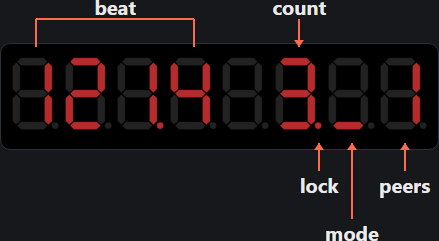
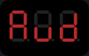
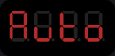
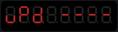
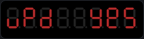
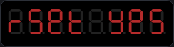
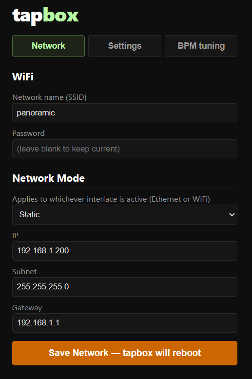
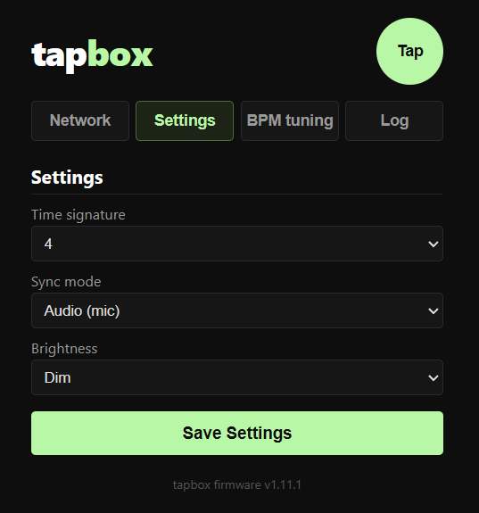
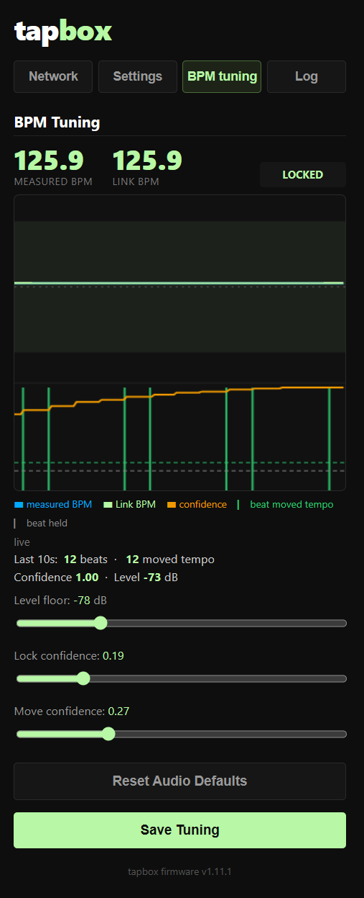

# tapbox

TapBox turns any music source into a steady Ableton Link tempo and downbeat master—whether the beat comes from a CDJ, an audio signal, or your own finger.

The device is based on a ESP32 controller that joins an [Ableton Link](https://www.ableton.com/en/link/) session over Ethernet or WiFi. Built on the [WT32-ETH01](http://www.wireless-tag.com/portfolio/wt32-eth01/) module with a MAX7219 8-digit 7-segment display. The famous silent sanwa button OBSF 30 serves as your tap button.


## Features

- **Four sources** — **Tap** (manual tap tempo), **Mic** (microphone auto-detects BPM, you tap the downbeat), **Line** (same detection from a 3.5 mm line-level input), and **CDJ** (Pioneer Pro DJ Link). Chosen with the  menu item; the active source is shown by a bar on the display (top = CDJ, middle = Tap, bottom = Mic, top + bottom = Line)
- **Tap tempo** — tap 4 times to lock in BPM and phase-align to the Link session (Tap source)
- **Audio beat detection** — an INMP441 I2S microphone listens to the room and refines the tempo automatically via an FFT/mel-filterbank onset detector and a dynamic-programming beat tracker (`BTrack`), within a tunable BPM range of your tap — your tap is always ground truth; the detector can never wander off on its own. → [How beat detection works](BEAT_DETECTION.md)
- **Line-in beat detection** — a PCM1808 24-bit stereo ADC feeds a 3.5 mm line-level signal (mixer booth/aux out, media player, phone) into the same detector — no room noise, no mic-to-speaker acoustic delay
- **Pioneer CDJ sync** — passively listens for Pro DJ Link beat packets on the same network; bridges CDJ tempo directly into the Ableton Link session
- **Ableton Link** — joins the Link network automatically on boot; peers shown on display
- **Two-button control** — tap button for tempo and menu navigation; select button for confirm/back
- **Ethernet or WiFi** — Connects to your network as a client; browser config page for credentials; auto-failover to WiFi if no Ethernet present. Can also run as a **WiFi access point** or with a **direct Ethernet cable** to a laptop — no router needed.
- **Static or DHCP** — configure IP address, subnet, and gateway via the web config page
- **IP ticker on boot** — non-blocking scroll of connection type, IP address, and security PIN at startup (, , or ); the PIN doubles as the WiFi AP password and the web config page login; device is fully operational during the scroll
- **OSC control** — UDP server on port 8000 for remote tap, BPM set, nudge, and downbeat reset
- **Menu system** — on-device configuration with NVS persistence across power cycles
- **OTA updates** — open the menu, hold both buttons 3 s, release and confirm with select; device reboots and flashes latest firmware automatically on next network connection
- **Factory reset** — open the menu, hold both buttons 8 s, confirm with select; returns device to store-bought state

## Hardware

| Component | Part |
|-----------|------|
| MCU / Ethernet | WT32-ETH01 (ESP32 + LAN8720A) |
| Display | MAX7219 8-digit 7-segment module |
| Input | Two momentary push buttons (tap + select) |
| Microphone | INMP441 I2S MEMS microphone (for Mic source) |
| Line-in ADC | PCM1808 24-bit I2S stereo ADC breakout + 3.5 mm TRS socket (for Line source) |
| Power / charging | Integrated lithium charge/discharge/boost module (often sold as "TP4056 boost module") — USB-C, three-stage charging at 1 A (configurable up to 2 A via resistor), 5 V boost output (configurable 5/9/12/15 V), automatic charge/discharge switching, charge/discharge/polarity protection, 35 µA quiescent current |

### Pin Assignments

| GPIO | Function |
|------|----------|
| IO35 | Tap button — input-only, needs **external 10 kΩ pull-up to 3.3 V** |
| IO39 | Select button — input-only, needs **external 10 kΩ pull-up to 3.3 V** |
| IO4  | INMP441 SCK (I2S bit clock) |
| IO12 | INMP441 WS (I2S word select) |
| IO36 | INMP441 SD (I2S data in) |
| IO14 | MAX7219 CLK |
| IO2  | MAX7219 DIN |
| IO15 | MAX7219 LOAD/CS |
| IO5  | PCM1808 SCKI — 8 MHz system clock, LEDC-generated (silk `RXD`) |
| IO17 | PCM1808 BCK — I2S bit clock, PCM1808-generated (silk `TXD`) |
| IO32 | PCM1808 LRC — I2S word clock, PCM1808-generated (silk `CFG`) |
| IO33 | PCM1808 OUT — I2S data in (silk `485_EN`) |

INMP441 wiring: **VDD → 3.3 V**, **GND → GND**, **L/R → GND** (selects the left channel), plus SCK/WS/SD as above.

PCM1808 wiring: **+5 V and 3.3 V** supplies (this breakout has no onboard regulator), **MD0 → 3.3 V**, **MD1 → 3.3 V** (Master mode, 256fs → 31.25 kHz sampling), **FMT → GND** (I²S format; silk-labelled `PMT` on some boards), **SCK ← IO5**, plus BCK/LRC/OUT as above. The PCM1808 masters the I2S bus; the ESP32 receives as a slave. 3.5 mm socket: **tip → LIN**, **ring → RIN**, **sleeve → the analog GND pin between LIN and RIN**.

> GPIO 0, 16, 18, 19, 21, 22, 23, 25, 26, 27 are used by the onboard Ethernet — do not reassign.  
> GPIO 34–39 are input-only with **no internal pull-up** — the tap/select buttons on IO35/IO39 therefore require external pull-ups.  
> IO12 is a flash-voltage strapping pin (used here for I2S WS); acceptable on the WT32-ETH01.

## Display Layout



- **beat** — current BPM, four digits with decimal point (`120.0`)
- **source bar** — horizontal segments: **top = CDJ**, **middle = Tap**, **bottom = Mic**, **top + bottom = Line**
- **count** — beat position in the bar (1–4, or up to your time signature)
- **lock dot** — decimal point on the count digit: **solid** = locked (CDJ active / audio stable / tap set); **blinking** = Mic or Line source searching; **off** = no lock
- **peers** — number of other Ableton Link peers on the network

**Menu mode:**
```
[ label 0 ][ label 1 ][ label 2 ][ label 3 ][ blank ][ value right-justified ]
```


Value flashes at 4 Hz in edit mode.

## Controls

| Action | Result |
|--------|--------|
| Tap button (normal mode) | Tap tempo |
| Tap button (menu nav) | Advance to next item |
| Tap button held (menu edit) | Auto-increment value (5/sec after 500 ms, 20/sec after 1500 ms) |
| Select button short press | Enter menu / confirm |
| Select button long press (1 s) | Back / exit menu |

## Menu

| Label | Setting | Values |
|-------|---------|--------|
|  | Time signature | 2, 3, 4, 5, 6, 7 |
|  | Display brightness | 1 – 4 (live preview) |
|  | Source |  ·  (mic) · `LinE` (line-in) ·  (tap) |
|  | Network mode |  (DHCP) ·  (static) ·  (WiFi access point) |
|  | Current IP address | read-only; shows last octet; press **select** to scroll full IP across display |
|  | Firmware version | read-only; shows major.minor.patch |
|  | Exit menu | returns to normal mode |

 selects the source. The tuning parameters for the audio beat detector (shared by the Mic and Line sources), plus the static IP address, subnet mask, and gateway, are **web-only** (Network and BPM tuning tabs on the web config page, not on-device menu items) — see [BEAT_DETECTION.md](BEAT_DETECTION.md).  
Changing the network mode reboots after a 2-second `bOOt` display.  
 is read-only. Navigating to it shows the last octet of the current IP as a quick reference; pressing **select** scrolls the full IP address across the display.  
Menu times out after 6 seconds of inactivity without saving. The menu resumes at the last-visited item when re-opened.

> Factory reset and OTA update are **not** in the menu — see [System Functions](#system-functions) below.

## System Functions

Both system functions are triggered from **within the menu** by holding both buttons simultaneously. Open the menu first (select short press), then hold both buttons.

### OTA Firmware Update

Open the menu, then hold both buttons for **3 seconds**. The display shows . Release — the display shows . Press **select** to confirm. tapbox saves an update flag, erases OTA data if needed, and reboots. On the next boot, as soon as it gets a network connection, it downloads and installs the latest firmware. The display shows `UPd.` with a progress percentage, then  before rebooting into the new firmware.

### Factory Reset

Open the menu, then hold both buttons for **8 seconds**. The display shows  at 3 s then  at 8 s. Release and press **select** to confirm. tapbox resets all settings and reboots. Press **tap**, hold **select**, or wait 6 seconds to cancel.

## WiFi

tapbox prefers Ethernet. WiFi is used automatically when no Ethernet cable is present, and as a fallback if the cable is unplugged while running.

**First-time setup:**

1. Boot tapbox without an Ethernet cable.
2. Connect your phone or laptop to the **tapbox** open WiFi network.
3. Open **http://192.168.4.1** in a browser.
4. Enter your WiFi SSID and password and tap **Save Network — tapbox will reboot**.
5. tapbox reboots and connects to your network as a client.

The ESP32 radio supports **2.4 GHz only**. If your router broadcasts separate 2.4 GHz and 5 GHz SSIDs, use the 2.4 GHz one.

If WiFi credentials are stored but the connection fails, tapbox falls back to AP mode automatically so you can reconfigure without a factory reset.

## Direct Connection — No Network Required

tapbox can sync with a laptop running Ableton Live (or any Link-enabled app) without a router or existing network. Two approaches work.

### WiFi AP mode

The simplest option — tapbox creates its own open WiFi network and everything runs on it.

1. In the menu, navigate to  and set it to . Confirm with select — tapbox reboots.
2. On your laptop, connect to the **tapbox** WiFi network (open, no password).
3. Ableton Link is active immediately. Tap to set tempo and phase as usual.
4. The web config page is at **http://192.168.4.1** for display and network settings.
5. OSC commands reach tapbox at **192.168.4.1 port 8000**.

> OTA firmware updates are not available in AP mode (no internet path). CDJ sync is also unavailable — Pioneer players use a wired network and do not join a WiFi access point.

### Direct Ethernet

A single cable from tapbox to a laptop Ethernet port, with both ends set to a static IP. This gives the most stable connection and keeps the laptop's WiFi free for internet.

Modern hardware (including the WT32-ETH01 and USB-to-Ethernet adapters) supports auto-MDIX, so a standard patch cable works — no crossover cable is required.

**tapbox — set a static IP:**

1. In the menu, set  to .
2. On the web config page's Network tab, set the static IP, subnet, and gateway. Use a private range that is not in use on any other interface — for example:

   | Setting | Example |
   |---------|---------|
   | `IP  ` | `192.168.10.1` |
   | `Sub.` | `255.255.255.0` |
   | `Hub.` | `192.168.10.1` |

3. Connect the cable. tapbox boots straight to its static address with no DHCP wait.

**Laptop — set the Ethernet adapter to a static IP on the same subnet:**

| Setting | Example |
|---------|---------|
| IP address | `192.168.10.2` |
| Subnet mask | `255.255.255.0` |
| Default gateway | `192.168.10.1` *(or blank)* |

The web config page is at **http://192.168.10.1**. Ableton Link and OSC work on the same address. The laptop's WiFi can remain connected to the internet independently.

> Do not set the laptop gateway to an address outside the tapbox subnet — it will cause routing errors on that interface. Leaving the gateway blank or pointing it at the tapbox IP is safe.

## Web Configuration

  

The config page at `http://<tapbox-ip>` is accessible from any browser over Ethernet or WiFi. A **Tap** button above the tabs works from any of them — same tap the physical button drives. It has four tabs:

| Tab | Fields | Button | Effect |
|-----|--------|--------|--------|
| Network | WiFi SSID/password, Ethernet mode, static IP/subnet/gateway | Save Network — tapbox will reboot | Saves and reboots |
| Settings | Time signature, source, brightness | Save Settings | Saves and applies live — no reboot |
| BPM tuning | Level floor, lock confidence, move confidence, BPM range, plus a live confidence chart | Save Tuning | Applies live as you drag; see [BEAT_DETECTION.md](BEAT_DETECTION.md) |
| Log | Live scrolling log of tap/arm/lock events over the same WebSocket the chart uses — no controls, view-only | — | — |

## OSC Interface

Send UDP packets to the device on **port 8000**.

| Address | Argument | Action |  
|---------|----------|--------|
| `/tap` | — | Same as the tap button |
| `/bpm` | `float` or `int` | Set BPM directly |
| `/signature` | `int` | Set time signature (2–7) |
| `/nudge` | `int` (ms, signed, optional) | Nudge phase by `ms` (+ = advance, − = retard); no argument = 20 ms |
| `/downbeat` | — | Reset downbeat to now |

## Installing

Flash tapbox to your WT32-ETH01 directly from your browser — no software installation required:

**[Open Web Installer](https://dinther.github.io/tapbox/)**

Requires Chrome or Edge. Windows users may need the [CH340 driver](https://www.wch-ic.com/downloads/CH341SER_EXE.html) if the board is not detected.

Pre-built binaries are also available on the [Releases](https://github.com/dinther/tapbox/releases) page for manual flashing with esptool.

## Tools

Two Python scripts in `tools/` assist with development and testing. Both require Python 3 and no external packages.

### CDJ Simulator (`tools/cdj_sim_web.py`)

Broadcasts genuine Pro DJ Link 0x28 beat packets on UDP port 50001 — useful for testing CDJ sync without real hardware.

```bash
python tools/cdj_sim_web.py [bpm] [player]
```


Opens a browser-based control page at **http://localhost:8080** with:
- Live BPM display with ±1 / ±0.1 nudge buttons and a slider
- Beat-in-bar indicator (4 circles, beat 1 highlighted in amber)
- Player selector (1–4)
- Stop / Start toggle (tests the 2-second CDJ timeout on tapbox)
- **Downbeat** button — sends `Bb=1` immediately, triggering a bar-phase snap on tapbox

### Link Monitor (`tools/link_monitor.py`)

Prints the current Ableton Link session tempo and peer count to the terminal, useful for verifying that tapbox is pushing the right BPM into the Link session.

```bash
python tools/link_monitor.py
```

## Building

Requires [PlatformIO](https://platformio.org/).

```bash
# Build
python -m platformio run

# Build and flash
python -m platformio run --target upload
```

## License

MIT
